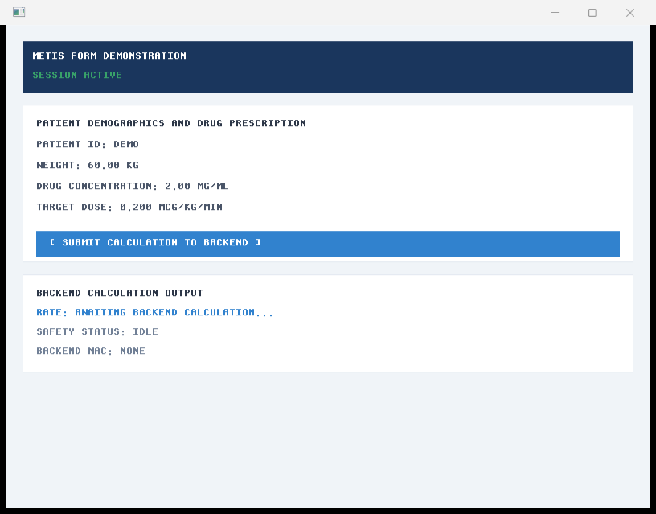
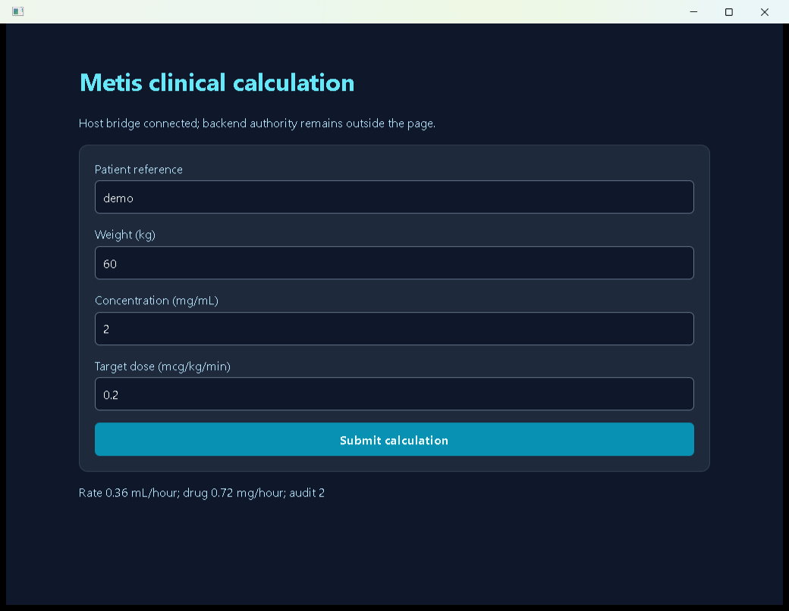
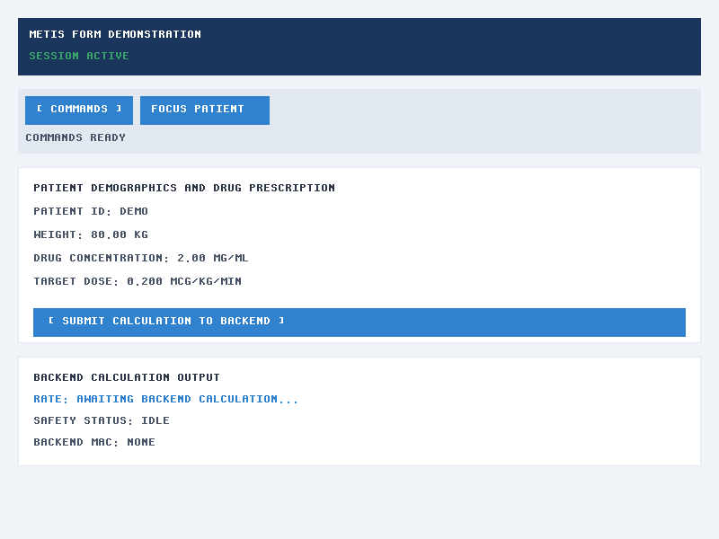
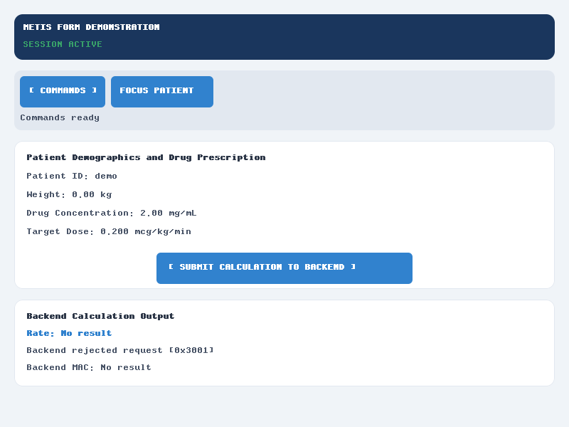
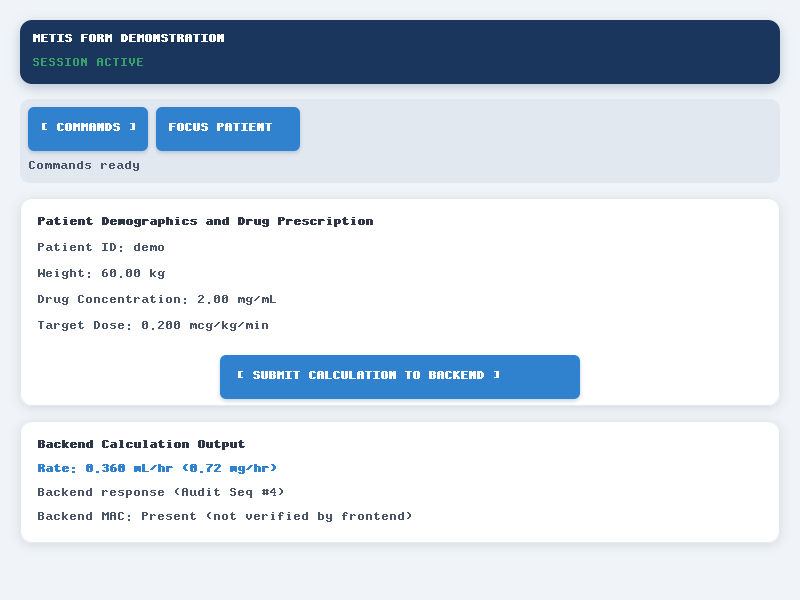
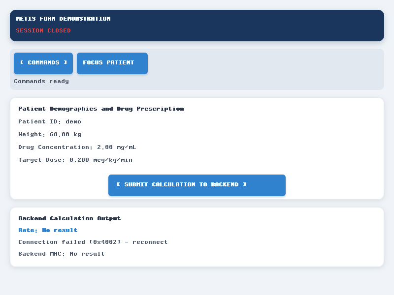
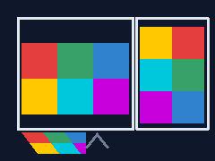

# Application gallery

These are captures of the production Metis form and its real backend responses,
rendered into an 800×600 software framebuffer through Iris. The runnable
[presentation example](../../examples/presentation.rs) uses bounded IPC and a
Moirai worker, asserts values and audit outcomes, and checks text geometry before
capturing each state. That software example does not create native controls or
execute in a browser; the separate [browser workbench](browser.md) exercises the
HTML5/CSS host.
The separate [process demonstration](getting-started.md) tests actual child processes.

## Starter theme and mark

The browser workbench ships a local starter vector mark for the application
header and favicon:


The SVG is a local, scriptless vector asset with a fixed viewport and literal
path colors. It is a replaceable project asset, not a remote stock download.
Applications can keep the same `Theme` selector and replace the semantic CSS
variables and this SVG in their own browser asset directory. The browser build
also carries a PNG alternate for user agents that do not select SVG sources.

The package demonstration derives `metis-mark.ico` from the same local artwork
for the Windows Start Menu shortcut. Its seven embedded PNG resolutions are
validated by `metis-cli` before the MSI is written; the portable package keeps
the SVG, PNG and ICO under `assets/` as well. The CLI applies the bounded SVG
contract before copying the vector resource, rejecting XML expansion, external
references, unknown attributes, malformed geometry and oversized viewports.

## Initial form


The defaults are 72.50 kg, 4.00 mg/mL and 0.500 mcg/kg/min. No result exists yet.

## Successful request


The example establishes a session and submits patient `demo`, weight 60 kg,
concentration 2 mg/mL and dose 0.2 mcg/kg/min. The backend returns 0.72 mg/hour
and 0.36 mL/hour at audit sequence 2. The MAC is present but not verified by the
frontend. These synthetic values demonstrate the protocol, not treatment guidance.

## Windows host snapshots

The production form also runs in the Windows native framebuffer and packaged
WebView2 hosts. These snapshots are captured from the supervised executable,
not reconstructed images; the initial and submitted states share the same
input-sensitive backend result.





The complete native/WebView2 initial and submitted pairs, trusted input actions,
window sizes and SHA-256 records are in the [Windows host workflow](native.md#captured-windows-workflows)
and its [capture manifest](images/native-captures.json).

## Edit invalidates the result



Changing weight to 80 kg immediately clears the old rate and MAC. No request has
been sent for these edited inputs; the form displays idle.

## Rejection and correction



The next request uses zero weight. The backend rejects it with code `0x3001` at
audit sequence 3. No prior result remains on screen. Full diagnostics are available
in the typed `FormState::Rejected` value.



Restoring weight to 60 kg succeeds on the same session at audit sequence 4.

## Disconnection and reconnection



The example joins the finite worker, which closes the real peer endpoint. A
subsequent submission reports `0x4002`, clears the result and shows a closed
session. Synchronization uses worker completion, not a timed sleep.


A new app and backend session submit weight 80 kg and return 0.96 mg/hour and
0.48 mL/hour. Reconnection never silently retries an uncertain transaction.

## Reproduce and review

```text
python scripts/verify.py
```

The Rust example writes fixed `output/form*.bmp`, `output/form*.svg` and
`output/form*.csv` files. SVG paths encode the actual raster; they do not rebuild
layout as SVG text. The CSV records actual inputs, actions, state, displayed
labels and text geometry alongside independently expected outcomes.

The gate removes previous required captures before execution. It validates all
seven new captures, checks BMP/SVG pixel agreement and compares both images and
semantic records with the [reviewed baseline](images/captures.json). Source,
lockfile and rendering-fixture hashes bind the observations to this run.
For an intentional visual change:

```text
python scripts/verify.py --update-snapshots
python scripts/verify.py
```

Inspect the generated images and semantic records before accepting the baseline.
`output/visual/latest/report.json` records each comparison; adjacent expected,
actual and difference images make failures inspectable. See
[Inspect application output](testing.md) for report interpretation and retention.
Source and lock digests normalize repository text to LF, matching the committed
`.gitattributes` contract across Windows and Unix checkouts.
`output/verification.json` records the complete gate, including failures before
capture. Additional browser responsive pending/cancellation and remaining
desktop host scenarios remain in the [visual scenario contract](../VERIFICATION.md#visual-contract).

## Raster image presentation

The software display list now accepts validated raster placements for local
decoded image data. `RasterImage` rejects empty, oversized and mismatched pixel
storage; `ImagePlacement` validates an in-bounds source crop, clips an off-screen
destination and uses nearest-neighbor sampling with source-over alpha. Format
decoding, orientation metadata and DICOM transfer syntax selection stay with the
owning Atlas provider, so this surface can receive RITK pixels without moving
medical parsing into Metis.

The deterministic [image example](../../examples/image.rs) renders a 3×2 color
fixture into a 240×180 framebuffer. Its generated artifact is inspected here:



Run it with `cargo run --locked --example image`; the BMP and SVG captures are
written under `output/`. This is software-renderer evidence for V06 and does not
establish browser decoding, orientation, fonts, media controls or native shell
presentation.

## DICOM viewer migration baseline

RITK's [synthetic DICOM workflow](https://github.com/ryancinsight/ritk/blob/main/docs/manual/dicom-workflow.md)
includes a capture of the running egui/eframe viewer alongside exact
software slice images. Selected-study workflows landed in
[RITK PR 236](https://github.com/ryancinsight/ritk/pull/236); physical display
proportions and the original viewer capture follow in
[RITK PR 237](https://github.com/ryancinsight/ritk/pull/237) at `8152f483`.
Its three-instance study has known decoded values,
anisotropic spacing and physical coordinates; no patient data is required.
The native workflow also requires a missing study to fail without producing a
successful-load screenshot.

The baseline exercises explicit series selection, primary and secondary loads,
authoritative DICOMDIR membership, failed replacement and session restore.
Physical image proportions now follow voxel spacing across layouts and texture
rotations, with paint and hit testing sharing a validated screen rectangle.
Patient-coordinate fusion and transformed measurement semantics remain required;
correct image proportions alone do not establish either property.
The manual explains the current input limits and how to reproduce the pixel
checks and native captures. These results establish the original viewer
baseline for [V09](../VERIFICATION.md#V09). Metis provides a bounded browser
named-byte batch handoff, while RITK owns the scanner, decoder, volume geometry
and medical display semantics. The merged
[RITK PR 269](https://github.com/ryancinsight/ritk/pull/269) adds the
`ritk-snap --metis-native` three-plane workflow: RITK opens and decodes the
study, selects the axial, coronal and sagittal planes, and produces one
spacing-aware `PresentationFrame`; Métis owns the native window, event pump and
framebuffer. Metis has no DICOM decoder or volume model. The follow-up
[RITK PR 271](https://github.com/ryancinsight/ritk/pull/271) keeps browser file
handles and bounded bytes in Métis while RITK performs the same classification
and decoding after the handoff.

The first Windows handoff opens the synthetic study, renders the three real
RITK planes, routes wheel navigation by panel and rejects a missing study. The
deterministic content capture is
[`dicom-metis-native.png`](https://github.com/ryancinsight/ritk/blob/main/docs/manual/images/dicom-metis-native.png)
at 1280×800; it is a framebuffer oracle rather than an operating-system window
golden. Full migration acceptance still requires browser runtime capture,
multiframe/color presentation, matched memory measurements, full app-window
overlays and packaging evidence.

The native handoff has also been exercised with the acquired MRI-DIR CT series,
not only the generated Part 10 study. RITK's user manual records the command,
the public CC BY 4.0 source, the reviewed 1280×800 output and its SHA-256 in
[the actual DICOM capture section](https://github.com/ryancinsight/ritk/blob/main/docs/manual/dicom-workflow.md).
That image is RITK application output transferred through the format-neutral
Métis framebuffer; Metis still owns no DICOM parser, metadata, geometry or
clinical display policy. Private clinical studies remain local and are never
committed to either repository.


The same saved public CT series was opened through the RITK browser adapter and
presented by the live Metis HTML5 canvas path. This is a runtime pixel capture,
not an illustration: RITK read all 409 Part 10 files (216,156,416 bytes),
decoded the study and supplied the axial, coronal and sagittal frames through
the format-neutral presentation boundary. The one Chromium capture used a
bounded programmatic `DataTransfer`; browser chrome is excluded, and the
capture does not claim physical drag-and-drop or cross-engine coverage.


The frame dimensions, non-black-pixel counts, SHA-256 values, source
revisions and input bounds are recorded in RITK's
[`dicom-metis-real-browser-orthogonal.json`](https://github.com/ryancinsight/ritk/blob/main/docs/manual/images/dicom-metis-real-browser-orthogonal.json).
The reproducible DICOM opening and visual workflow remains in the
[RITK user manual](https://github.com/ryancinsight/ritk/blob/main/docs/manual/dicom-workflow.md),
which owns the scanner, decoder, geometry and clinical display checks. Metis
owns the bounded file handoff, browser canvas and host lifecycle only.

The same current native host also opens the saved MRI-DIR T2 series. RITK
decoded 94 real DICOM files and transferred the axial, coronal and sagittal
MRI planes through the same format-neutral Métis framebuffer:


The run's file count, byte count, executable digest and image digest are in
[the RITK provenance record](https://github.com/ryancinsight/ritk/blob/main/docs/manual/images/dicom-metis-real-mri.json).
Both captures are public MRI-DIR porcine-phantom data, not generated
illustrations or private patient studies. A private clinical path is accepted
for a local run only and is never committed to this repository.

The same saved MRI-DIR T2 study was then opened through the packaged RITK
WASM browser path in the Codex in-app Chromium host. Métis accepted the 94 real
DICOM files as one bounded batch (49,807,236 bytes); RITK decoded them and
presented all three non-black canvases:

| Canvas | Presented pixels | Non-black pixels |
| --- | ---: | ---: |
| axial | 512 × 512 | 190,836 |
| coronal | 512 × 94 | 41,863 |
| sagittal | 512 × 94 | 38,843 |


These are live canvas exports from real DICOM decoding, not generated images.
The [RITK provenance record](https://github.com/ryancinsight/ritk/blob/main/docs/manual/images/dicom-metis-real-browser-mri.json)
binds the PNG hashes, source revisions and bounds. The capture excludes browser
chrome and uses a bounded programmatic drop in one Chromium host; physical
drag-and-drop, Firefox/WebKit, WebGPU and complete application-window capture
remain separate acceptance work.
The reproducible DICOM opening and visual workflow is maintained in the
[RITK user manual](https://github.com/ryancinsight/ritk/blob/main/docs/manual/dicom-workflow.md).
It runs the real scanner and loader, checks exact pixels and physical geometry,
and compares axial, coronal and sagittal captures with reviewed goldens. The
Metis browser capture proves only bounded input handoff and does not claim
DICOM decoding.

## Browser service workflow

The browser workbench has a live loopback capture path in addition to the
software gallery. Run the service command from [the browser manual](browser.md),
open the configured URL, and capture the authorized session, changed values,
`0x3001` rejection, stopped host and recovered session. The verified trace used
the Codex in-app browser at 1280×720 CSS pixels and device scale 1.25 with no
console warnings or errors. These browser captures are runtime observations;
the software gallery remains the deterministic image baseline.

## Result explorer

The browser workbench includes a bounded result explorer for applications that
receive more than one calculation response. It groups real responses by
patient, orders them by audit sequence or rate, filters patient references,
keeps selection stable across updates and exposes keyboard disclosure and
paging. The explorer is shared frontend state, so a native host can render the
same rows without adopting the browser controls. Empty, loading and typed
error states remain visible when the service is disconnected.

The current manual capture shows the empty explorer card and its semantic
controls at 1280×720; the connected-service workflow must add a live-row
capture before the RITK migration claims DICOM result-history parity. Native
value-semantic tests already cover insertion, update, eviction, filtering,
ordering, selection and tree disclosure from real typed responses.

## Framework comparison evidence

The complete comparison is maintained in
[ADR 0003](../adr/0003-framework-conformance.md). Iced 0.14 is included as a
renderer, state-model and testing comparator, and Axum 0.8 as a server/router
comparator; the current Metis build does not depend on either and this gallery
contains no Iced or Axum runtime capture. The official
[Iced examples](https://docs.rs/crate/iced/0.14.0/source/examples/README.md)
are the source reference for its native and web demonstrations. The former
[`iced_web`](https://github.com/iced-rs/iced_web) DOM runtime is archived, so
its existence does not establish HTML5/CSS compatibility for a current Iced
application or for Metis. Metis now demonstrates a bounded loopback HTTP
service over Moirai; [ADR 0025](../adr/0025-axum-server-boundary.md) defines
that first-party boundary and its public-deployment limits. Future comparator
captures require pinned, runnable fixtures and belong to their own verification
items.
