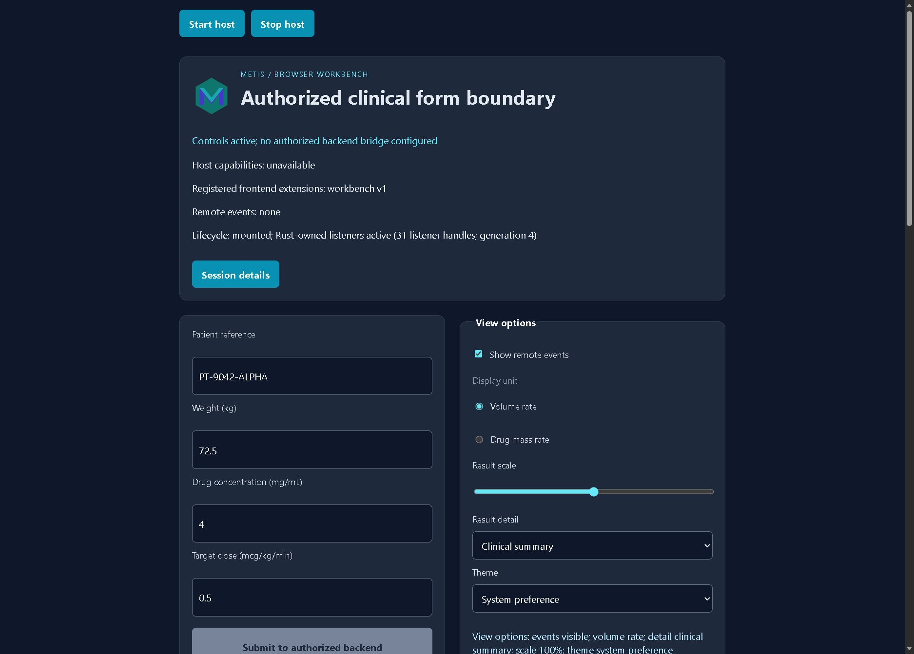
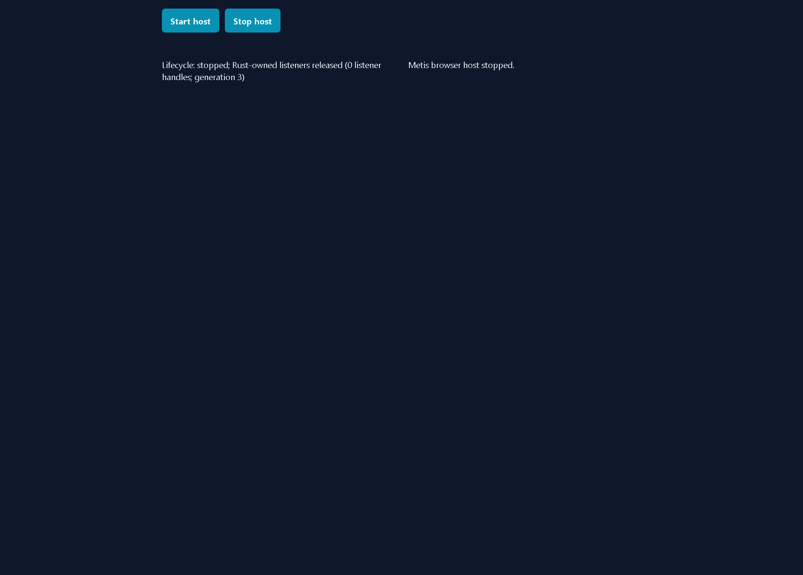
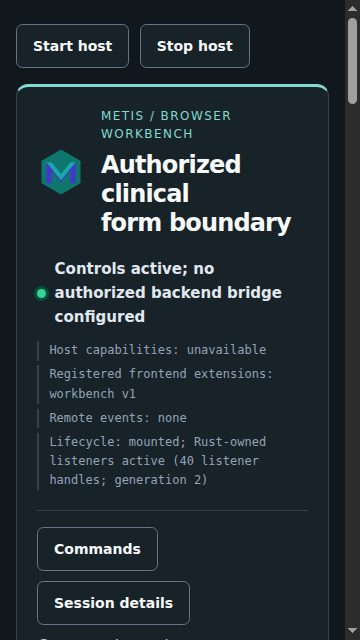
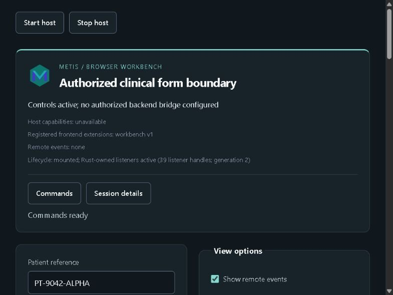
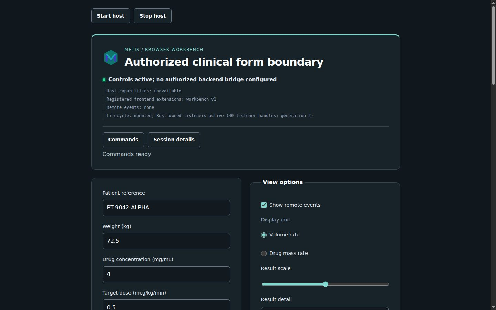
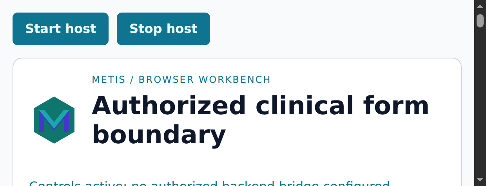
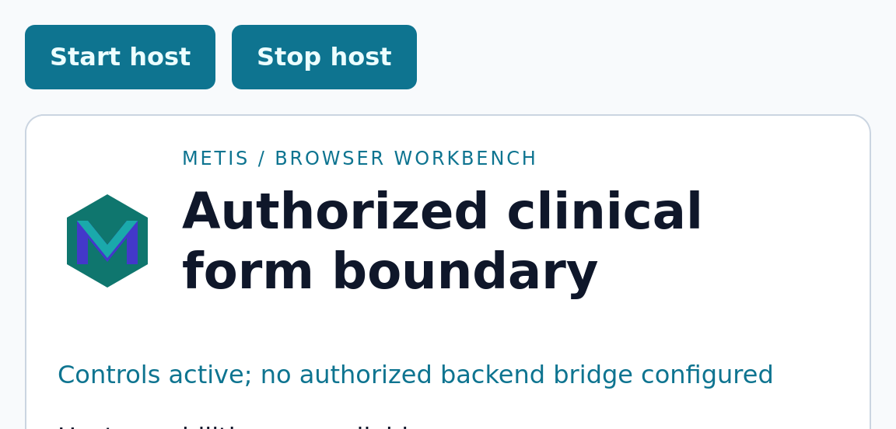
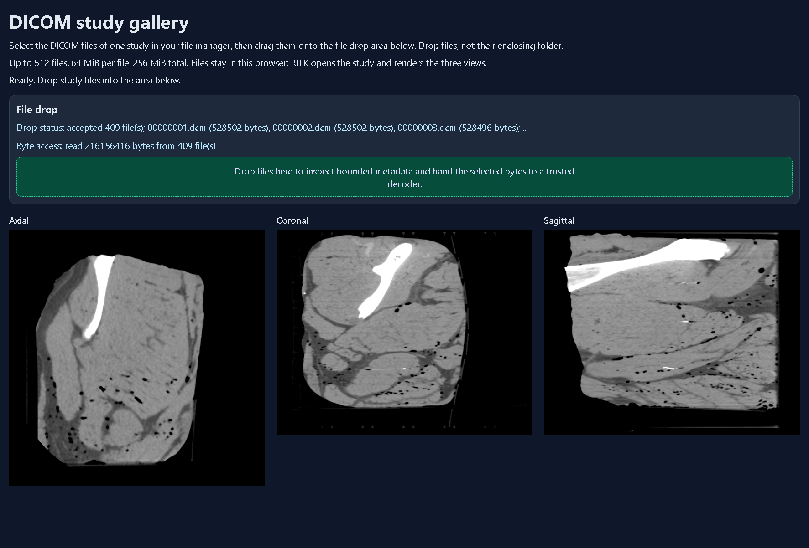
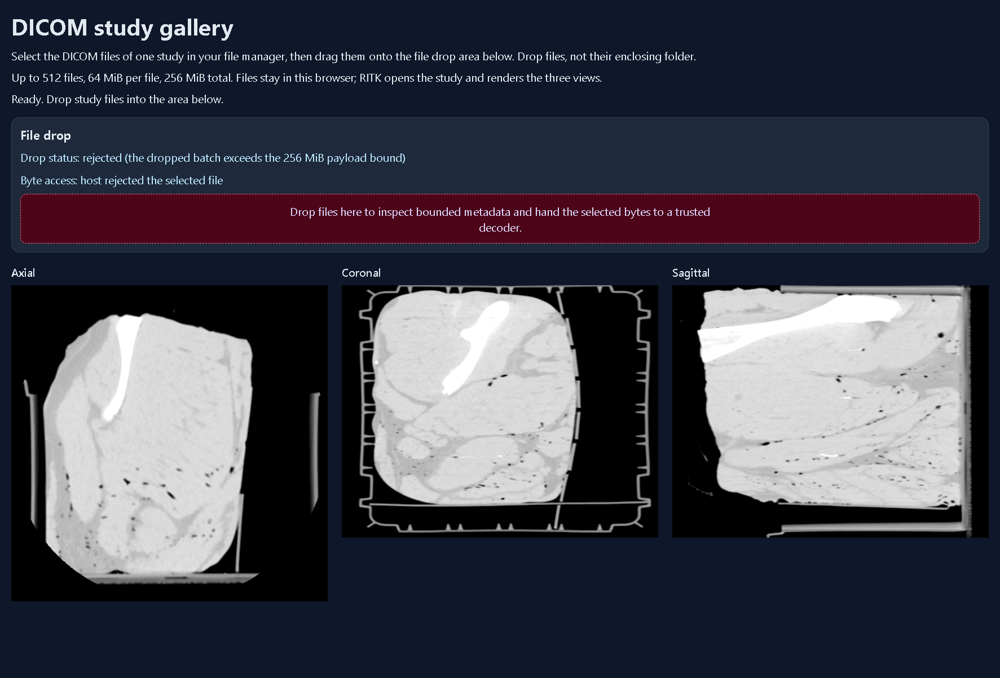

# Run the browser workbench

The browser workbench is the first executable HTML5/CSS host. The document,
external stylesheet and module bootstrap come from `examples/browser/`; Rust
owns the controls, captured inputs and event transitions through `metis-web`.
Moirai owns the DOM handles, WebSocket callbacks and listener lifetimes. The
page contains no backend key and does not perform the privileged clinical
calculation in downloaded WASM.

The page carries the same strict content-security policy as
`metis_core::HostPolicy`. The policy source is
`crates/metis-core/src/content_security_policy.txt`; the browser build checks
the HTML asset against that source before copying it. Scripts, styles and form
actions are same-origin. The development policy also admits the explicit
loopback WebSocket endpoint used by the service command; production hosts must
replace that source with their authenticated endpoint. The generated WASM
loader is permitted by `'wasm-unsafe-eval'`, and plugins are disabled. The
bootstrap also cancels cross-origin anchor navigation as a defense-in-depth
check.

The `frame-ancestors 'none'` directive is present for a host that delivers the
policy as an HTTP response header. Browsers do not enforce `frame-ancestors`
from a document meta tag, so the current static workbench has no framing
enforcement until its native or service host supplies that header. A host must
also enforce origin, session and operating-system policy at its boundary;
downloaded page code is not an authority source.

## Build and serve

Install the pinned `wasm-bindgen-cli` version matching the workspace's
`wasm-bindgen` dependency. The build script checks for exactly 0.2.128 and also
discovers this ignored local root, then run:

```text
cargo install wasm-bindgen-cli --version 0.2.128 --locked --root output/wasm-bindgen-cli
python scripts/browser.py build
python -m http.server 8080 --directory output/browser
```

Open `http://127.0.0.1:8080/` in a browser for the disconnected local-control
workflow. A file URL is not accepted because module and WASM loading require an
HTTP origin.

The same generated assets include a format-neutral HTTP boundary probe. Start
the bounded service in a second terminal:

```text
cargo run --locked -p metis-app -- --metis-http-service http://127.0.0.1:8080 8766 66666666666666666666666666666666
```

Open `http://127.0.0.1:8080/http-health.html`. The page sends a real
cross-origin `GET /health`, performs a binary session handshake, dispatches a
generation-bound fragment action and displays the returned text patch. It then
probes malformed, unauthorized and stale-generation requests; the stale probe
must leave the previous text unchanged. The page is an HTML5/CSS demonstration
of the presentation boundary; it does not load, decode or retain DICOM data.
RITK owns that workflow.

To exercise cancellation at the same boundary, start the service with a
bounded asynchronous response delay:

```text
cargo run --locked -p metis-app -- --metis-http-service http://127.0.0.1:8080 8766 66666666666666666666666666666666 --response-delay-ms 4000
```

Activate **Reset mount** while the initial probe is pending. The new
generation must retain the reset status, empty response, fragment and negative
diagnostics after the four-second response window; no completion from the
aborted request may update the remounted page. The probe is bounded to 30,000
milliseconds and uses Moirai's timer, so it does not block the executor.

The in-app browser capture on 2026-09-11 at the pre-change Metis revision
`cadb684ca7c8bda3f1c873f93286871e620e6196` showed the complete live state:
`Authenticated fragment boundary ready`, `200 metis-http-ready`, handshake
`200`, fragment `200 (1 patch)`, accepted `session` action, malformed `400`,
unauthorized `401`, unchanged stale state and lifecycle generation `1`. This
is one real browser-rendered visual trace of the local presentation boundary;
it is not cross-engine WebDriver evidence. No DICOM data entered the page.

The delayed-reset capture was run against Metis revision
`e6b84432bc8a94515f0a332592ff392127788f00`. It entered the pending probe,
advanced from generation `1` to `2` on **Reset mount**, and remained at the
empty reset state after the four-second response window.

### Current live fragment capture — 2026-09-14

The current Metis revision `ed3806811f23271310cb04078dff55aba5c90944` was
opened in the Codex in-app Chromium host at
`http://127.0.0.1:8080/http-health.html` while a real loopback
`metis-app.exe --metis-http-service` process served the boundary on port
`8766`. The [machine-readable provenance record](images/metis-http-fragment-live.json)
binds the source revision, executable digest, service origin and viewport
artifacts. It records three user-visible states from the same live page:

1. [Success](images/metis-http-fragment-live-success.jpg) reports the `200`
   health response, `200` handshake, one accepted fragment patch, all four
   negative probes and lifecycle generation `1`.
2. [Reset](images/metis-http-fragment-live-reset.jpg) reports generation `2`
   with empty response, fragment and negative fields after **Reset mount**;
   the prior generation is marked stale.
3. [Recovery](images/metis-http-fragment-live-recovered.jpg) reports a new
   accepted fragment patch on generation `2` after remount.

These are viewport captures of the actual HTML5/CSS presentation boundary,
not generated artwork. The probe contains no DICOM bytes or patient
identifiers; DICOM loading, decoding and viewer state remain in RITK. This is
one live Chromium observation and does not close cross-engine WebDriver,
provider-private allocation, TLS or operating-system permission evidence.

### Live Edge WebDriver fragment capture — 2026-09-14

The dependency-free runner also completed the same scenario through the
bundled Microsoft Edge WebDriver `153.0.4234.19` and Edge `154.0.4258.12`.
At Metis revision `77b1c278d610562b04d138aea2d37b828ff097a5`, the run used a
1500 × 1074 CSS viewport at device scale `1.25`, captured three 1875 × 1343
PNG states, and closed the WebDriver session with no pending request. The
[provenance record](images/metis-http-fragment-webdriver-edge.json) contains
the exact hashes and semantic trace:

```text
python scripts/browser_runtime.py --engine chromium --browser-name MicrosoftEdge \
  --driver-url http://127.0.0.1:9517 --scenario fragment \
  --url http://127.0.0.1:8080/http-health.html \
  --output output/browser/runtime/chromium-fragment.json
```

The [success](images/metis-http-fragment-webdriver-edge-success.png),
[reset](images/metis-http-fragment-webdriver-edge-reset.png) and
[recovered](images/metis-http-fragment-webdriver-edge-recovered.png) captures
show health and handshake `200`, one accepted patch, malformed `400`,
unauthorized `401`, target rejection, unchanged stale state, reset generation
`2`, remounted generation `2` and clean teardown. This is one Chromium-family
WebDriver observation on Windows; Firefox, WebKit, TLS, operating-system
permissions and provider-private resource counts remain separate evidence.

## Run the cross-engine conformance trace

The repository includes a dependency-free W3C WebDriver runner. It uses the
same Rust/WASM page and scenario for Chromium, Firefox and WebKit, then writes
one schema-1 JSON trace at `output/browser/runtime/<engine>-<scenario>.json` and PNG
screenshots under `output/browser/runtime/screenshots/<engine>/`. The browser
and its WebDriver endpoint are host or CI prerequisites; the runner does not
install a driver or add a JavaScript test runtime. Configure one endpoint per
engine, for example:

```powershell
$env:METIS_WEBDRIVER_CHROMIUM_URL = "http://127.0.0.1:9515"
$env:METIS_WEBDRIVER_FIREFOX_URL = "http://127.0.0.1:4444"
$env:METIS_WEBDRIVER_WEBKIT_URL = "http://127.0.0.1:4444"
```

Chromium-family drivers may select a different W3C browser name. This is
needed for Microsoft Edge, whose driver rejects the default `chrome` name;
the engine remains `chromium` because the browser uses the Chromium protocol:

```text
python scripts/browser_runtime.py --engine chromium --browser-name MicrosoftEdge --driver-url http://127.0.0.1:9517 --serve-dir output/browser --bridge disconnected
```

The override is validated against the selected engine. `firefox` accepts only
`firefox`, `webkit` accepts only `safari`, and Chromium accepts `chrome` or
`MicrosoftEdge`.

The inspected Edge workbench capture is preserved in the [sanitized trace](images/metis-browser-edge-workbench.json). It records the two input mutations, the disabled privileged action, stop/remount state and JavaScript heap observations without retaining driver process paths. The remounted view is the final state after the old controls were released:



The same workbench now has a live four-cycle Edge capture at Metis revision
`012ed7175268c283cb4b8cbd617f1a138d955532`. Each cycle stopped the Rust/WASM
mount, released all 27 controls and 31 Rust-owned listener handles, then
remounted a fresh generation with the same positive counts. The disconnected
bridge stayed disabled, the session ended with zero pending requests, and the
WebDriver session closed cleanly. The [sanitized lifecycle trace](images/metis-browser-edge-lifecycle.json)
contains the exact state transitions, heap observations and screenshot hashes.





The input-change states are also preserved as [after-weight](images/metis-browser-edge-lifecycle-after-weight.png)
and [after-dose](images/metis-browser-edge-lifecycle-after-dose.png) captures.

Run the disconnected format-neutral workflow against the generated assets:

```text
python scripts/browser_runtime.py --engine chromium --serve-dir output/browser --bridge disconnected
python scripts/browser_runtime.py --engine firefox --serve-dir output/browser --bridge disconnected
python scripts/browser_runtime.py --engine webkit --serve-dir output/browser --bridge disconnected
```

Each command fails if its endpoint is missing, the page does not mount the
Rust-owned form, either of the two input changes is not reflected in the DOM,
or the stop/remount generation retains application controls or an old result.
The semantic snapshot also records the visible lifecycle status, the
`data-metis-listener-count` and `data-metis-generation` root attributes, and
requires stop to report zero Rust-owned listener handles before remount reports
a positive count on a newer generation.
Waits run inside the browser with a `MutationObserver` or one bounded timer;
the host does not sleep or poll. The trace includes the negotiated browser
capabilities, exact actions and observed values, semantic snapshots, screenshot
hashes/dimensions, the three explicitly unsupported native operations and
cleanup evidence. Review the screenshots and the semantic states together.

Use `--device-scale` to request a bounded high-DPI browser session. The value
is fixed-point decimal text between `0.5` and `4`; the trace records both the
requested value and the browser's effective `devicePixelRatio` and CSS viewport:

```text
python scripts/browser_runtime.py --engine chromium --browser-name MicrosoftEdge --driver-url http://127.0.0.1:9517 --serve-dir output/browser --bridge disconnected --device-scale 2
```

Chromium and Edge receive their native scale-factor launch option, while
Firefox receives `layout.css.devPixelsPerPx`. WebKit has no WebDriver scale
override and rejects values other than `1`, so an unsupported high-DPI claim
cannot pass silently. The same option is available on the canvas, fragment and
file-backed gallery runners; RITK still owns DICOM decoding and all image
assertions.

The protocol client also provides the format-neutral physical-input seam used
by application-owned canvas scenarios. A consumer resolves its canvas element
through WebDriver and sends trusted pointer and wheel actions without placing
application state in Métis:

```python
from scripts.browser_protocol import WebDriverClient

client.pointer_drag(canvas_element_id, (24, 24), (64, 48))
client.wheel(canvas_element_id, (64, 48), (0, 120))
client.release_actions()
```

The canvas trace snapshots each element's CSS dimensions before dispatch and
derives the element-local offsets from those dimensions. The WebDriver element
origin is the canvas center, so the runner clamps each requested point to
`floor(css_size / 2) - 1` on each axis. This keeps pointer and wheel events
inside short letterboxed canvases as well as full-sized surfaces; the trace
records the effective offsets. The client also bounds wheel deltas,
action-source count, per-source action count and serialized request size. RITK
owns the DICOM workflow and interprets these format-neutral events; Métis
records transport and screenshot evidence only. A configured engine endpoint is
required before the action trace can claim Chromium, Firefox or WebKit
evidence.

### Run the hosted cross-engine matrix

The same trace runs in the scheduled or manually dispatched `Metis verification`
workflow. The `browser-assets` job builds the locked Rust/WASM page once, then
the `browser-runtime` matrix runs it with the preinstalled Chromium and Firefox
drivers on Ubuntu and Safari's WebDriver on macOS. Chromium and Firefox run the
workbench at device scale `2`; Safari runs the explicitly supported scale `1`.
The hosted images provide the
browser/driver pair; see the [Ubuntu runner image inventory](https://github.com/actions/runner-images/blob/main/images/ubuntu/Ubuntu2404-Readme.md)
and [Apple's WebDriver setup](https://developer.apple.com/documentation/safari-developer-tools/macos-enabling-webdriver).
Safari automation is enabled explicitly with `sudo -n /usr/bin/safaridriver --enable`;
the hosted runner supplies passwordless elevation for this system setting, so no
registry or signing credential is involved. Each matrix job waits up to twenty
seconds for the driver's `/status` response before creating a session, and
each WebDriver request has a sixty-second bound for the slower Firefox launch.

Dispatch the workflow from a checked-out repository with the GitHub CLI:

```text
gh workflow run ci.yml --ref main
gh run list --workflow ci.yml --limit 1 --json databaseId,status,conclusion,headSha
```

The run produces one `metis-browser-runtime-<engine>-<run-id>` artifact for
each engine. Each artifact contains the schema-1 lifecycle trace and the PNGs
captured from the running browser window. A successful matrix is the evidence
for the three configured engines; a local Edge or Chromium capture remains a
separate single-engine observation. The jobs are schedule/manual only so a
pull request's Windows gate remains within its normal verification budget.

Hosted dispatch `34759186816` at Metis revision
`67689e5001f65d22ac388397442eb99df9bfe0ef` passed all three runtime jobs. The
[Chromium artifact](https://github.com/ryancinsight/metis/actions/runs/34759186816/artifacts/10318696257)
used Chrome 152.0.7977.82 and emitted five 1050×637 PNGs; the
[Firefox artifact](https://github.com/ryancinsight/metis/actions/runs/34759186816/artifacts/10318098189)
used Firefox 155.0 and emitted five 1152×635 PNGs; the
[Safari/WebKit artifact](https://github.com/ryancinsight/metis/actions/runs/34759186816/artifacts/10317374757)
used Safari 26.6.2 and emitted five 1024×674 PNGs. Every trace records the
two input changes, four stop/remount cycles, zero stopped listeners, 31
remounted listeners, zero pending requests and `session_closed: true`. Firefox
and WebKit correctly report JavaScript heap observations as unavailable rather
than fabricating values; Chromium records its bounded `performance.memory`
observations. The [workflow run](https://github.com/ryancinsight/metis/actions/runs/34759186816)
also retains the single [asset artifact](https://github.com/ryancinsight/metis/actions/runs/34759186816/artifacts/10318272226)
consumed by all three jobs.

### Run a consumer-owned canvas trace

The same runner has a canvas scenario for an application that owns one or more
HTML5 canvases. It captures the full browser window and each named canvas,
records its intrinsic and CSS dimensions, sends one trusted pointer drag and
wheel action to each element, and releases all WebDriver input sources before
closing the session. The trace keeps the Metis revision and the optional
consumer revision separate; the consumer revision must be a 40-hex Git
revision when supplied.

For the RITK browser viewer, run the page that mounts the RITK-owned canvases
and pass their IDs. The runner has no DICOM knowledge and does not interpret a
slice, voxel, series or medical state:

```text
python scripts/browser_runtime.py --scenario canvas --engine chromium --url http://127.0.0.1:8080/ritk.html --consumer-revision <RITK-40-HEX> --canvas-id ritk-snap-axial --canvas-id ritk-snap-coronal --canvas-id ritk-snap-sagittal
```

Consumers may add a bounded `--canvas-attribute data-*` argument for each
opaque DOM attribute they own. The runner records the requested values under
each canvas snapshot, uses `null` when an attribute is absent, and never
interprets the name or value. At most 16 names are accepted and each returned
value is limited to 1024 UTF-8 bytes. This lets a consumer such as RITK carry
its own semantic evidence without moving that meaning into Metis:

```text
python scripts/browser_runtime.py --scenario canvas --engine chromium --url http://127.0.0.1:8080/ritk.html --consumer-revision <RITK-40-HEX> --canvas-id ritk-snap-axial --canvas-id ritk-snap-coronal --canvas-id ritk-snap-sagittal --canvas-attribute data-ritk-load-state --canvas-attribute data-ritk-frame-state --canvas-attribute data-ritk-axis --canvas-attribute data-ritk-slice-index --canvas-attribute data-ritk-slice-count --canvas-attribute data-ritk-frame-width --canvas-attribute data-ritk-frame-height
```

Repeat the command for `firefox` and `webkit` with their configured driver
endpoints. The resulting schema-1 trace uses `bridge: "canvas"`, records
`consumer_revision`, stores both window and element PNG hashes, and records
the requested opaque attributes under each canvas snapshot. RITK remains
responsible for the DICOM byte drop, viewer reducer, axis/slice assertions and
the clinical visual oracle. A
missing driver endpoint is an unfulfilled evidence requirement, not a passing
or skipped engine result.

For an Edge canvas run, keep `--engine chromium` and add the same browser-name
override:

```text
python scripts/browser_runtime.py --scenario canvas --engine chromium --browser-name MicrosoftEdge --driver-url http://127.0.0.1:9517 --url http://127.0.0.1:8080/ritk.html --consumer-revision <RITK-40-HEX> --canvas-id ritk-snap-axial --canvas-id ritk-snap-coronal --canvas-id ritk-snap-sagittal
```

Each canvas trace also installs a bounded capture-phase observer for the four
input event kinds used by the scenario. The pointer and wheel action records
include the observed event type, `isTrusted` value and target canvas; every
observed event must be trusted and targeted to the requested canvas. The
observer consumes at most 32 records per canvas and is removed before the final
window capture. This proves the browser transport delivered trusted events and
that the runner released its own diagnostic listeners; provider-private
listener registries remain outside WebDriver's contract.

For the authorized service path, keep the static server and service running,
then pass the host-provided session tuple in the URL. The runner validates the
`ws`/`wss` endpoint, decimal process identifier and 32-hex-digit principal
before navigation:

```text
python scripts/browser_runtime.py --engine chromium --driver-url http://127.0.0.1:9515 --url "http://127.0.0.1:8080/?endpoint=ws%3A%2F%2F127.0.0.1%3A8765%2Fsocket&process=42&principal=66666666666666666666666666666666" --bridge authorized
```

The query separators in a shell URL must remain `&`; the encoded endpoint is
shown only so the WebSocket value stays one query field. The authorized trace
waits for **Authorized backend session ready**, submits the real service
request, and asserts `Volume rate: 0.900000 mL/hr`. Add `--cancel` while the
service is running with `--response-delay-ms 4000` to stop and remount during a
pending response; the delayed response must not change the new generation:

```text
python scripts/browser_runtime.py --engine chromium --driver-url http://127.0.0.1:9515 --url "http://127.0.0.1:8080/?endpoint=ws%3A%2F%2F127.0.0.1%3A8765%2Fsocket&process=42&principal=66666666666666666666666666666666" --bridge authorized --cancel --cancel-grace-ms 4500
```

The browser runner does not open native file dialogs, launch native processes,
grant operating-system permissions or parse DICOM. RITK owns DICOM opening,
series selection, decoding, geometry and viewer state; see the
[RITK DICOM workflow manual](https://github.com/ryancinsight/ritk/blob/main/docs/manual/dicom-workflow.md). The
runner's cleanup statement means that the stopped DOM has zero mounted
controls, the remounted form reports `aria-busy=false`, and no stale completion
appears after remount. Provider-private
listener registries, OS handles, installed IMEs and post-drop allocations
require their owning Moirai/RITK/native evidence and are not inferred from a
browser screenshot.

## Connect the real browser service

The service executable is the same `metis-app` image used by the native
demonstration. It accepts one loopback WebSocket session, checks the request
`Origin` before sending `101 Switching Protocols`, constructs a trusted
`HostContext`, and then runs `AsyncIpcServer` with bounded messages and finite
deadlines. Start it in a second terminal while the static server is running:

```text
cargo run --locked -p metis-app -- --metis-browser-service http://127.0.0.1:8080 8765 66666666666666666666666666666666
```

Open the workbench with host configuration in the URL (the bootstrap copies
these values into the hidden configuration fields before Rust mounts the app):

```text
http://127.0.0.1:8080/?endpoint=ws%3A%2F%2F127.0.0.1%3A8765%2Fsocket&process=42&principal=66666666666666666666666666666666
```

The endpoint, process identifier and 32-hex-digit principal are transport
configuration, not credentials. The service's trusted context and capability
signature remain authoritative. The demonstration is loopback-only and uses
`ws://`; it does not establish TLS server authentication.

## Verify stop/remount disposal at the service boundary

The browser service can delay a successful clinical response for a bounded
interval. This exercises the same WebSocket and `AsyncIpcServer` path as the
normal workflow while leaving handshake, rejection and event frames immediate:

```text
cargo run --locked -p metis-app -- --metis-browser-service http://127.0.0.1:8080 8765 66666666666666666666666666666666 --response-delay-ms 4000
```

With the configured workbench URL open, wait for **Authorized backend session
ready**, activate **Submit to authorized backend**, and immediately activate
**Stop host**. The stopped page must contain only `Metis browser host stopped.`
Start the host again before the four-second delay expires. The remounted form
must show its new generation and either the fresh session state or the explicit
`Backend unavailable [ERR_TRANSPORT_BROKEN]` state when the one-connection
conformance service has closed; it must not show the old result. After at least
four seconds, inspect the page again. The accessibility tree and screenshot
must remain unchanged, with no stale result or event from the stopped request.

The 2026-09-07 trace used the Codex in-app browser at a 1280×720 CSS-pixel
viewport and device scale 1.25. It observed **Request in progress**, stopped
the host, remounted it, then waited beyond the delay. The remounted tree stayed
at `Backend unavailable [ERR_TRANSPORT_BROKEN]` with `Remote events: none`; the
delayed response did not mutate the new DOM. The browser engine version and
post-drop allocation counts were unavailable, so this is lifecycle evidence
for one engine and the real loopback service, not cross-engine or allocation
proof.

## Exercise the real Rust state

Change the weight, concentration or dose fields. The result panel updates from
the Rust-owned `FormInputs` and the status returns to idle for each valid edit.
Enter a non-numeric value to observe the typed `ERR_NUMERIC_INSTABILITY`
display. With no service configuration, submit the form to observe
`ERR_CONNECTION_CLOSED`; this is an explicit disconnected result, not a local
calculation or a fabricated success. The submit control is disabled until an
authenticated bridge is ready and becomes disabled again while a request is in
flight; changing the DOM or dispatching a click cannot bypass that lifecycle
guard.

The **View options** fieldset uses semantic HTML5 controls owned by the Rust
host. Uncheck **Show remote events** to hide the event status line while the
event remains received and validated; select **Volume rate** or **Drug mass
rate** to change the displayed metric; move **Result scale** with the arrow
keys or pointer to select a bounded 50–150% presentation preference; choose
**Clinical summary** or **Audit detail** from **Result detail** to change the
rendered response annotation. The
`options-state` text and `data-result-scale-percent` attribute expose the
Rust-owned state after each change. Tab through the labels, press Space on the
checkbox or radio, use the range arrows, and open the select to reproduce the
keyboard path.

## Explore retained results

The **Result explorer** is a bounded, host-independent view of real backend
responses. Each accepted response is retained under its validated patient
reference and audit sequence. Duplicate audit sequences update their row; the
history evicts its oldest row at the fixed capacity. The explorer never
calculates a value in the browser and never renders the response signature.

Use **Filter patient references** to restrict the visible tree, and choose an
order from **Order results** to sort by audit sequence, patient, volume rate or
drug rate. Patient groups are keyboard-operable disclosure buttons. Their rows
are keyboard-operable selection buttons, and the pager exposes at most eight
visible tree entries at once. The live status reports `empty`, `loading`,
`ready` or a typed producer error; a failed refresh leaves previously accepted
rows available for inspection.

The native `metis-frontend` tests exercise inserted and updated responses,
exact sort and filter values, stable selection, eviction, replacement,
disclosure, paging and malformed input. The browser asset test checks the
labels, table caption, live region, control IDs and delegated listener events.
For a browser capture, build and serve the workbench, scroll to **Result
explorer**, and inspect its empty state before connecting a service. The
2026-09-08 CUA trace used the generated page at
`http://127.0.0.1:8095/?cache=explorer-20260908` in a 1280×720 CSS-pixel
viewport at device scale 1.25. The screenshot showed the result card, filter,
order select, table caption and disabled pager. Changing the filter to `PT`
and then `X` updated the table caption and returned `Entries 0 of 0`; keyboard
deletion cleared it. No backend bridge was configured for this capture, so it
does not claim a live-row rendering; the real row path is covered by the Rust
tests and the connected-service trace remains required for viewer acceptance.
The exact gate and runtime limitations are recorded in the [V07 result explorer
evidence](../VERIFICATION.md#result-explorer-evidence--2026-09-08).

## Hypermedia boundary

The [htmx documentation](https://htmx.org/docs/) models a browser interaction as
an event that issues a request and places the response in a selected target.
`hx-target` names the target and `hx-swap` defines standard DOM replacement
modes ([target reference](https://htmx.org/attributes/hx-target/), [swap
reference](https://htmx.org/attributes/hx-swap/)). Metis uses that separation as
an implementation rule without shipping an htmx runtime or accepting arbitrary
HTML from a backend.

Ordinary `input` and `change` events bubble to `#metis-app`. Rust maps the
target ID to a closed input/control binding, applies the typed state transition,
and updates only the allowlisted text and attributes. Pointer, file, text and
dialog events keep their specialized Moirai provider listeners. Static
application markup is installed once; backend values and diagnostics always use
text or attribute setters, so a message cannot create a script or element.
The authenticated binary WebSocket remains the current service contract. The
first typed fragment action uses it: activating **Session details** sends a
generation-bound `FragmentAction` for `status.describe` through the scoped
`ui` plugin. The backend returns a bounded `FragmentPatchSet`; the browser
preflights the allowlisted target and applies the result with a text setter. The
response cannot add markup, scripts, selectors or navigation, and the existing
`metis-events` status target keeps the static control inventory unchanged.

The HTTP demonstration applies the same contract in its own request lifecycle.
It preflights every target and attribute before any DOM setter, reads response
bodies through a 16 KiB streamed bound, and associates health, handshake,
fragment and negative-probe requests with the current mount lease. Reset aborts
the lease and clears the old fragment result before incrementing the generation;
stale completions cannot update the new page.

Exercise it with an authorized service session by activating **Session details**
and inspecting `metis-events`. The value must contain
`Fragment action status.describe accepted: session-dialog`. Stop and remount the
host while a request is pending; the old generation must not update the new
mount. A configured WebDriver run is still required for cross-engine captures;
the native protocol and policy suites are the current deterministic evidence.

The admitted loopback HTTP demonstration implements that boundary over
Moirai. Start it beside the static workbench with a fixed browser origin:

```powershell
cargo run --locked -p metis-app -- --metis-http-service http://127.0.0.1:8080 8766 66666666666666666666666666666666
```

`GET /health` returns the bounded readiness text. `POST /v1/session` accepts a
binary `HandshakeRequestPayload`; the response is a typed
`HandshakeResponsePayload`. After that response, send the returned capability
token in a `PluginInvocationPayload` to `POST /v1/fragments`. The response body
is a `FragmentPatchSet` whose text and attribute operations are applied through
the same browser allowlists as the WebSocket path. Every request must carry the
exact configured `Origin`. Unknown routes, wrong methods, malformed envelopes,
missing sessions and a full session table return bounded
`ErrorResponsePayload` values. Moirai owns body, header, response, deadline and
connection limits; the application closes after its finite request budget.

The server's real loopback suite covers the successful handshake/fragment
journey, exact-origin CORS preflight, origin and route denial, malformed and
oversized bodies, a disconnected peer, idle-peer deadline and finite teardown.
The optional response-delay probe is bounded and asynchronous so the browser
reset path can be observed against a pending real request. It does not add an
Axum or htmx runtime and it never accepts arbitrary markup
or scripts. [ADR 0025](../adr/0025-axum-server-boundary.md) records the
comparison and the first-party boundary. RITK remains responsible for DICOM
scanning, decoding, series selection, geometry and viewer state; this fragment
contract carries presentation messages only.

### Capture the authenticated fragment boundary

The dependency-free WebDriver runner has a dedicated `fragment` scenario for
the HTTP page. It waits for the real health response, authenticated handshake
and typed patch, then checks malformed (`400`), unauthorized (`401`),
unallowlisted-target and stale-generation probes before resetting the page and
running the patch again on the new generation. The runner captures the three
stable page states and closes the driver session cleanly. It requires a fixed
same-origin page because the HTTP service binds its exact `Origin` policy:

```powershell
python scripts/browser_runtime.py `
  --scenario fragment `
  --engine chromium `
  --driver-url http://127.0.0.1:9515 `
  --url http://127.0.0.1:8080/http-health.html `
  --browser-heap-sample `
  --timeout-seconds 30 `
  --output output/browser/runtime/chromium-fragment.json
```

Start the static server on port `8080` and the `--metis-http-service` role on
port `8766` with the same origin before running the command. The trace's
`authenticated-success`, `reset-stale-generation` and `remounted-success`
screenshots are component evidence; they do not claim DICOM decoding. RITK's
consumer-owned gallery remains the source for actual CT/MRI pixels. The
demonstration service retains one session per principal until its bounded
process exits; start a fresh service for a new page load. A `409`
`ERR_PRIVILEGE_ESCALATION_ATTEMPT` after reusing the same principal is the
intentional duplicate-session rejection.

To demonstrate the boundary, serve the workbench, change **Weight (kg)** and
**Result scale**, and capture the form before and after each action at the same
viewport. The semantic tree must retain the same controls while the result text,
`data-result-scale-percent` attribute and `options-state` value change. Enter
`` in **Clinical note**; the preview must show the
literal characters and the DOM must contain no added element. The existing
browser visual and semantic capture records the target engine, viewport and
rendered state for this check; the committed trace is in the [delegated-control
evidence](../VERIFICATION.md#browser-delegated-control-evidence).

## Theme and branding

The **Theme** select applies one of four bounded presentation modes:

- **System preference** sets `data-metis-theme="system"` and follows the
  browser's `prefers-color-scheme` value.
- **Light** sets `data-metis-theme="light"`.
- **Dark** sets `data-metis-theme="dark"`.
- **High contrast** sets `data-metis-theme="high-contrast"` and keeps borders
  and focus indicators legible on a black and white palette.

Rust owns the selected mode through `metis_web::Theme`; the browser host writes
the same value to the document body and `#metis-app`. `styles.css` maps those
attributes to semantic variables such as `--metis-page`, `--metis-surface`,
`--metis-text`, `--metis-accent` and `--metis-focus`. An application can keep
the selector and replace those variables in a same-origin stylesheet to apply
its own palette. Theme state changes presentation only; it does not change
backend authority, IPC messages or application data.

The page loads the starter [Métis vector mark](../../examples/browser/assets/metis-mark.svg)
from the same-origin `assets/` directory and uses it as the favicon and header
image. A PNG alternate and the multi-resolution
[native icon](../../examples/browser/assets/metis-mark.ico) remain in the same
directory for browsers and packaged applications that need those formats.
`python scripts/browser.py build` copies all three local assets and fails if a
declared mark is missing. Replace the SVG, PNG, ICO and the `.metis-mark` rule
with project-owned artwork for a branded application. The browser host does
not fetch an icon, font or media resource from a remote origin.

The packaging boundary admits a strict SVG subset so an installer never stores
an unbounded document language: one fixed positive viewport, optional
`xMidYMid meet`, literal hexadecimal paints, finite numeric opacity and
self-closing path elements. XML declarations, entities, scripts, external
references, unknown attributes, malformed geometry and dimensions over 4096
pixels are rejected before the resource enters a portable or MSI payload.

To demonstrate the contract, build and serve the workbench, select each mode,
and capture the header, view-options card and focus ring at the same viewport.
The static asset suite checks all four selector values and variable branches;
runtime captures must record the browser engine and operating-system
presentation settings because CSS media preferences are host behavior.

The 2026-09-08 CUA trace used the generated page at 1280×720 CSS pixels and
device scale 1.25. It selected **Light**, **High contrast** and **Dark** in the
native Theme control; each accessibility snapshot reported the matching option
and `View options: ... theme <mode>`, while the inspected screenshots showed the
light, black-and-white and dark palettes with the same mark and layout. A DOM
read after the dark selection reported `data-metis-theme="dark"` on both the
body and `#metis-app`, dark page/text colors and a loaded local mark. This is
explicit mode evidence for one browser engine; system media preference,
forced-colors, the V04 viewport/scale matrix and native host integration remain
separate host checks. MSI shortcut icon wiring is covered by the native package
database test and the distribution workflow.

The **Pointer capture** card demonstrates the browser pointer lifecycle that a
drag interaction needs. Press or drag **Pointer capture surface**. On
`pointerdown`, Rust reads the browser `PointerMetadata` snapshot through
Moirai, captures the identifier on the surface and verifies that the browser
retained it. The status includes the pointer device, viewport coordinates,
changed and held buttons, modifier keys and primary-pointer state. Captured
`pointermove` events update the same metadata record while dragging. On
`pointerup` or `pointercancel`, Rust releases the same identifier and updates
the status to the released metadata record for the trace's first pointer.
The capture handle is owned by the mounted listener set, so **Stop host**
drops the callbacks with the rest of the browser application. The surface
accepts at most two distinct identifiers at a time, captures each through
Moirai and reports a typed browser-host error if a duplicate, third pointer or
provider capture/release operation is rejected.

The 2026-09-07 pointer trace used the generated browser build at a 1280×720
CSS-pixel viewport and device scale 1.25. Its accessibility tree exposed the
surface as a named group, and the full-page screenshot showed the pointer card,
the semantic status and the unchanged backend-result panel. The provider
revision and observed status are recorded in
[browser pointer-capture evidence](../VERIFICATION.md#browser-pointer-capture-evidence--2026-09-07).
The metadata trace and provider revision are recorded in
[browser pointer-metadata evidence](../VERIFICATION.md#browser-pointer-metadata-evidence--2026-09-07).
The pointer trace used provider revision
`a3c86cd183a18edc35db30f1d35e79fe80092df4`; the current consumer lock uses
the co-evolution revision `9e045f73be49b9ae6272045dd71705dcf14eccf8`.

The **Wheel** status below the pointer status demonstrates the browser scroll
boundary. Scroll the named **Pointer capture surface**. Rust reads Moirai's
`WheelMetadata` record and renders the horizontal, vertical and depth deltas,
their pixel/line/page unit, viewport coordinates and modifier keys. The
listener prevents the browser default action after the event kind is
validated; the gesture section below applies the bounded pan and zoom policy.

The 2026-09-07 wheel trace used the generated browser build at 1280×720 CSS
pixels and device scale 1.25. An in-app browser scroll action produced
`Wheel: delta (0.00, -129.60, 0.00) pixel at (386, 580), modifiers none`; a
horizontal action produced `delta (426.40, 0.00, 0.00)` at the same target.
The trace is automation-generated browser input; the CUA surface does not
expose the hardware `isTrusted` flag, so this evidence does not claim a
physical-wheel or cross-engine result. The provider revision is
`f634b3a802ec0355da22f111ed01067d2435c5cb`; full command output and the
rendered screenshot are recorded in
[browser wheel metadata evidence](../VERIFICATION.md#browser-wheel-metadata-evidence--2026-09-07).

The pointer surface also exercises the Rust-owned gesture policy. Drag from
one point to another to pan the content; ordinary wheel input pans by its
normalized CSS-pixel delta; hold Control while scrolling to zoom. With two
captured pointers, move either contact to pan by the pair's centroid and zoom
by its distance ratio. The policy accepts at most two distinct pointers,
rejects a third, clamps pan to ±1024 CSS pixels and zoom to 50–300%,
normalizes line and page units to 16 and 640 CSS pixels, and rejects non-finite
deltas without changing state. `gesture-status` reports the action, pan and
zoom, while the content's CSS transform provides the visible result. A
zero-distance pair waits for a valid baseline before changing zoom. Touch
pointers use the same bounded policy.

The 2026-09-07 gesture trace used the generated build at the same 1280×720
CSS-pixel viewport and device scale 1.25. An upward scroll rendered
`Gesture: wheel pan; pan (0.0, -129.6) CSS px; zoom 100%`; a rightward scroll
then rendered `pan (426.4, -129.6) CSS px`; dragging from `(300, 590)` to
`(420, 620)` rendered `Gesture: release; pan (546.4, -99.6) CSS px; zoom 100%`.
The live screenshot showed the translated content and the semantic status.
The trace is automation-generated; CUA cannot expose hardware trust, native
touch, IME or another browser engine. Native policy tests cover line/page
normalization, bounded zoom and non-finite rejection; the live trace does not
claim physical-input or cross-engine parity.

The two-pointer policy is covered by the native Rust suite: the second pointer
establishes a centroid and finite-distance baseline, movement updates pan and
zoom from that baseline, a zero-distance pair waits for valid separation, and
a third pointer is rejected. The generated page instruction and semantic
pointer card are visible in the [pinch gesture evidence](../VERIFICATION.md#browser-pinch-gesture-evidence--2026-09-08).
The Codex browser cannot inject trusted physical touch, so a live screenshot
does not claim hardware multi-touch behavior.

The **File drop** card demonstrates the browser file and metadata workflow.
Drag one or more files onto **File drop**. Rust prevents the browser's default
navigation, asks Moirai for a bounded `DropFiles` capture, and renders the file
count and the first three display names with byte sizes. The zone exposes
`dragenter`, `dragover`, `dragleave` and `drop` state through the semantic
`drop-status` region and its `data-drop-state` attribute. A rejected metadata
record leaves the zone in the typed rejected state and reports the provider
error without retaining the batch.

For an accepted drop, the browser host reads every selected file asynchronously
through Moirai's owned browser `File` handles. Each file is limited to 64 MiB
and the batch to 256 MiB; a 64 KiB continuation buffer keeps each `FileReader`
turn bounded while the provider still enforces its 1 MiB maximum read. The
consumer reports `reading` and then `complete` or `failed` through
`drop-byte-status` and `data-byte-state`. The handoff performs no format
classification. A completed batch is available to a trusted WASM consumer
through `metis_web::take_file_drop`, which transfers ownership of the batch.
Call `FileDropBatch::into_files` and
`FileDropPayload::into_parts` when the consumer must retain the entries; moving
the tuple preserves each byte allocation. A later drop replaces an unconsumed
batch, and stop/remount drops it. No browser name is turned into a filesystem
path. A RITK adapter receives the named bytes and performs any format-specific
scan, decode and study opening; this slice closes the bounded zero-copy byte
handoff, not a format-specific workflow.

The provider caps one drop at 512 files, 4096 UTF-8 bytes per name and 256 bytes
per media type; the consumer keeps the batch below its separate 256 MiB byte
budget. The CUA browser surface cannot synthesize a trusted
operating-system file drop, attach a local file to a synthetic event or expose
`isTrusted`, so a manual trace must record the browser engine and whether the
drop came from a physical file operation. Native policy tests cover bounds,
typed rejection and payload size budgets; the WASM gate compiles the real
provider-backed read path.

The 2026-09-08 CUA trace opened the generated build at a 1280×720 CSS-pixel
viewport with device scale 1.25. The accessibility tree exposed **File drop**,
both status regions and the named **File drop zone** group; the
screenshot showed the drop card between the pointer and backend-result cards
with its ready state and focus outline. The browser engine version was
unavailable, and no trusted local file was attached, so the trace does not
claim a successful live byte read or format-specific decode. The provider-backed
full batch path is established by the native policy suite and the strict WASM
build; the RITK consumer smoke is now recorded in the
[RITK DICOM workflow](https://github.com/ryancinsight/ritk/blob/main/docs/manual/dicom-workflow.md#inspect-the-browser-canvas-visual-smoke).
The ownership-consuming API is covered by a pointer-identity test, so moving
a completed batch does not copy its file contents.

The **Text and composition** card exercises the browser's native editing
surface while keeping application state in Rust. Focus **Clinical note**, type
ordinary text, select a range with the pointer or keyboard, and inspect
`text-status`, `selection-status` and the `data-selection-*` attributes. The
seeded value includes an accented character, an em dash, CJK text and mixed
symbols so the displayed selection offsets make the browser's UTF-16
coordinate convention visible. The `text-preview` line is regenerated from
the bounded Rust value after every input event.

For an IME-capable environment, switch to a CJK input method and type into
**Clinical note**. `compositionstart` and `compositionupdate` show the bounded
preedit and locale, `compositionend` reports the commit transition, and
`compositioncancel` clears the preedit without inventing a committed value.
The browser `InputEvent` snapshot also reports its operation name, optional
data and composing marker. The listener set is dropped with **Stop host**, so
remounting starts with the seeded value and a fresh selection.

The 2026-09-08 CUA trace opened the generated page at
`http://127.0.0.1:8095/?cache=text-clean-20260908` in a 1280×720 CSS-pixel
viewport at device scale 1.25. The accessibility tree and inspected screenshot
showed the seeded value and a `16`-unit caret. Browser `typeText` input appended
` typedX`; the rendered value became `Résumé — 東京 / 影像 typedX`, the text
status reported `Text: input insertText applied; data X`, and the selection
status reported a `23`-unit forward caret. This is ordinary browser input
evidence; CUA does not expose a trusted operating-system IME or `isTrusted`.

The policy caps the value at 1 MiB, event metadata at 128 UTF-8 bytes and the
locale at 64 bytes. UTF-16 offsets are transport coordinates; the Rust policy
rejects an offset inside a surrogate pair before it changes state, while
grapheme boundaries remain a host contract. This workflow therefore does not
claim grapheme-safe caret movement, bidi shaping, fallback-font metrics,
clipboard/undo behavior, assistive-technology behavior or native IME delivery.
CUA can show the real HTML textarea, statuses and focus ring, but it cannot
provide a trusted OS IME event or expose `isTrusted`; record the browser engine
and input method when collecting host evidence.
The browser provider for this workflow is Moirai revision
`0862716265d657b8069d5a47fd1e77ae26ddd006`; the consumer lock is updated to the
same merged revision.

## Responsive runtime capture

The page uses a bounded responsive grid. At widths below `700px`, the form and
options stack in one column with `1rem` page padding; wider viewports use two
`minmax(0, 1fr)` columns inside a `960px` content bound. Grid items accept
long status and clinical strings without widening the page, and the host
buttons use the same narrow-viewport padding. Option rows and the result-scale
slider expose a `44px` CSS hit target so their labels remain usable on touch
and keyboard layouts. The CSS contract test checks these declarations.

The Browser viewport capability captured the generated workbench at
`360×640`, `800×600` and `1440×900` CSS pixels with device scale `1`. The
runtime manifest records the exact card rectangles, grid columns, scroll
extents and interactive target rectangles in
[`browser-layout-metrics.json`](images/browser-layout-metrics.json), bound to
the stylesheet SHA-256 recorded in that file. The captures show the narrow
single-column layout, the two-column fixture and the bounded wide layout:







The measured pages have no horizontal overflow; every card and required
interactive target ends inside the viewport, and the option rows and slider
measure `44px` high at all three widths. The runner now exposes a bounded
device-scale override and records the effective ratio in each trace. A
configured browser endpoint is still required to produce live scale-2
screenshots; physical monitor transitions and platform fractional-scale cases
remain V04/V05 host evidence.

### Hosted device-scale capture

The manually dispatched [Metis verification run](https://github.com/ryancinsight/metis/actions/runs/34770298938)
captured the same workbench at device scale `2` in Chromium 152.0.7977.82 and
Firefox 155.0. The traces report effective `devicePixelRatio` `2`, CSS
viewports of `620×237` and `576×276`, four stop/remount cycles, zero stopped
listener handles, 31 remounted listener handles, zero pending requests and a
closed WebDriver session. Safari 26.6.2 is the scale-`1` control in the same
matrix. The [revision-bound provenance record](images/metis-browser-device-scale.json)
contains the artifact links, screenshot hashes and sanitized lifecycle results.





These are hosted browser-window captures of the format-neutral Metis workbench;
they verify scale negotiation and lifecycle behavior. DICOM decoding and
patient-image presentation remain RITK-owned and are shown in the [RITK
application gallery](applications.md#real-dicom-application-evidence).

## Exercise the accessibility presentation

The workbench keeps the normal keyboard path in document order. From the
header, press **Tab** through **Session details**, the patient and numeric form
fields, **Submit to authorized backend** when the authorized bridge enables it,
the **View options** controls, the named **Pointer capture surface**, the named
**File drop zone**, and **Clinical note**. A disabled submit control is
skipped by the browser, and a radio group has one tab stop; use its arrow keys
to choose the other unit. The closed session dialog is not in the active tab
order.
Opening **Session details** uses the browser dialog semantics; **Close** is the
dialog action and focus returns to the opener after dismissal. Status and
composition regions use polite, atomic live announcements, while labels and
headings provide names for each control group. The form and result status set
`aria-busy="true"` during an in-flight backend request and return it to
`"false"` when the result settles; the explorer table follows the same state
for a loading result page.

The stylesheet responds to the user's presentation preferences. With
`prefers-reduced-motion: reduce`, scrolling is immediate and transitions or
animations resolve to a single short frame. With `forced-colors: active`, cards
and controls use system `Canvas`, `CanvasText`, `ButtonFace`, `ButtonText` and
`Highlight` colors so borders and focus indicators remain visible. Browser zoom
remains available; the responsive grid stacks below `700px` and keeps content
inside the `960px` bound.

The static browser asset contract checks the semantic names, live regions,
atomic announcements and busy-state wiring,
non-positive focus order and both media-query branches. For a host acceptance
run, enable a supported screen reader, reduced-motion setting, forced-colors
setting and browser zoom, then capture the accessibility tree, focus ring and
spoken action for each state. Record the browser engine, operating system,
scale factor and assistive-technology version. A semantic tree or CSS rule by
itself does not establish screen-reader support or an operating-system
accessibility bridge.

The captured service journey at revision
`d879779247c8cfc5870f62f99a5364cbbf2d3c58` used the Codex in-app
browser at 1280×720 CSS pixels and device scale 1.25. Pointer activation of
**Drug mass rate** changed the summary to `drug mass rate` and the result to
`Drug mass rate: 2.175000 mg/hr` without clearing the accepted backend result.
Pointer activation of **Show remote events** changed the event line to
`Remote events: hidden by preference` while retaining that metric. Two
keyboard **Right** presses on **Result scale** changed the semantic value to
`120` and the summary to `scale 120%`; selecting **Audit detail** changed the
semantic select value to `Audit detail`, changed the annotation to
`Audit detail: sequence 4`, and retained the result. The focused range received
the visible keyboard focus ring.

The header's **Session details** button exercises the native HTML dialog path.
Activate it after the host reports ready. Rust calls the Moirai `show_modal`
seam; the dialog exposes the current session status and capability summary as
text and keeps browser focus on its **Close** button. Activate **Close** to call
the Rust `close_dialog` seam. The native `close` event restores focus to
**Session details** through Moirai's `focus` seam. Press **Escape** to exercise
the browser's cancel path; it closes the dialog and restores the same opener.
The dialog open-state read is used to avoid duplicate modal transitions.

The 2026-09-07 trace at the same 1280×720 CSS-pixel viewport and device scale
1.25 captured the modal backdrop and focus ring, matched the ready status and
capability text in the accessibility tree, verified the `open` attribute while
modal and its absence after both close paths, and observed focus return to the
opener. It used Moirai revision
`8f02b8b7de6cf6361b519bd79759d8508568fbdb`.

The same service trace verified the submit lifecycle. Before the handshake, the
accessibility tree marked **Submit to authorized backend** disabled. Once the
bridge reported ready, the control became enabled. With the service started
using `--response-delay-ms 4000`, submitting changed the status to **Request in
progress** and marked the control disabled; after the delayed response, the
button became enabled and the result showed `Volume rate: 0.543750 mL/hr`.
On a disconnected workbench, attempting to activate the disabled control timed
out without changing the status or accessibility tree.

The 2026-09-08 service-backed CUA trace also inspected the live attributes
while the delayed request was in flight. `metis-status`, `metis-form`,
`result-state` and `explorer-table` all reported `aria-busy="true"` alongside
the **Request in progress** announcement. After the four-second response,
each returned to `"false"`; the tree exposed **Backend result received**, the
retained result row and the enabled submit control. This demonstrates that the
busy state follows the Rust pending/loading state and settles with the real
backend result in the browser engine.

With the service configuration above, the status becomes `Authorized backend
session ready`, and the header lists the commands advertised by that service
(`host.capabilities`, `host.target_capabilities`, `session.heartbeat`,
`clinical.calculate` and `plugin.invoke`). It also displays the host target
platform and installed surfaces (`native-process` and
`browser-websocket` for this service), followed by the local WASM/DOM/CSS
surfaces. These values come from the versioned Metis capability and target
descriptors after the authenticated handshake; they are not page-provided
permission claims. Submit the defaults to observe the real backend response, then
change the fields to `80`, `4` and `0.75` and submit again. The result panel
must show the echoed patient reference and those exact formatted values. Set
weight to `0` to observe `Backend rejected request [0x3001]`; the previous
result is cleared before the rejection is displayed. After an accepted
calculation the header also shows `Remote event: clinical.result` with the
nonzero event identifier, audit sequence and typed rates. A rejected request
does not produce a clinical event and the status line says so.

Hosts can use the same catalog from Rust with the synchronous or asynchronous
IPC client:

```rust
let catalog = client.discover_capabilities()?;
assert!(catalog.supports(metis_core::MessageType::ClinicalCalcReq));
let target = client.discover_target_capabilities()?;
assert!(target.supports(metis_core::TargetCapability::BrowserWebSocket));
```

The target descriptor is evidence of the service boundary that accepted the
session. A Windows or Linux platform value does not claim a native window,
operating-system permissions, accessibility or IME support; those surfaces
appear only after their host providers are implemented and explicitly added.
Starting or stopping the WASM application advances a lifecycle generation.
Completions from a cancelled connection or an earlier mount are discarded
before they can restore state or render into the new DOM.
If a host rejects the handshake, the browser preserves the peer's exact
16-bit error code in the session-failed state; local transport failures remain
typed connection failures.

The lifecycle status line is visible in the page while these transitions run.
For example, after stopping it reads `Lifecycle: stopped; Rust-owned listeners
released (0 listener handles; generation N)`. A fresh start replaces it with a
mount message that reports the positive listener-handle count and generation
`N + 1` (or a later generation when another transition occurred). The runtime
trace records both counts and generations in its cleanup object; the count is
Metis-owned evidence and does not include provider-private event registrations.

Local host events use `metis_ipc::EventHub<E, CAPACITY>`. Each subscription has
its own bounded queue; `publish` returns `ERR_QUEUE_FULL` instead of blocking,
and `unsubscribe` removes delivery before a later publication. Callers use
`Subscription::recv_timeout` with a finite deadline. Remote event wire types
are versioned, bounded, and rejected when the envelope version differs from the
negotiated contract. Native callers can send a typed unsolicited event
through the same frame boundary:

```rust
#[derive(Debug, PartialEq, Eq)]
struct Status(u16);

impl metis_core::EventCodec for Status {
    const NAME: &'static str = "host.status";

    fn encode(&self) -> metis_core::Result<Vec<u8>> {
        Ok(self.0.to_be_bytes().to_vec())
    }

    fn decode(bytes: &[u8]) -> metis_core::Result<Self> {
        let value = <[u8; 2]>::try_from(bytes)
            .map(u16::from_be_bytes)
            .map_err(|_| metis_core::MetisError::protocol(
                metis_core::ErrorCode::MalformedPayload,
                "Status event body must contain one big-endian u16",
            ))?;
        Ok(Self(value))
    }
}

let event = metis_core::RemoteEventPayload::from_event(1, &Status(3))?;
server.send_event(&event)?;
let event = client.recv_event()?;
assert_eq!(event.decode_as::<Status>()?, Status(3));
```

Hosts register extension metadata through a typed, bounded registry. The
manifest is static, so registration cannot add an unbounded callback list or
grant an operating-system privilege. Each operation names the capability that
the host must verify before a handler runs:

```rust
use metis_core::{CapabilityScope, MAX_PLUGINS, Plugin, PluginDescriptor,
    PluginOperation, PluginRegistry};

static EVENTS: [PluginOperation; 1] = [PluginOperation::new(
    "result.received",
    CapabilityScope::STREAM_TELEMETRY,
)];
struct ViewerExtension;
impl Plugin for ViewerExtension {
    const DESCRIPTOR: PluginDescriptor =
        PluginDescriptor::new("viewer", 1, &[], &EVENTS);
}

let mut plugins = PluginRegistry::<MAX_PLUGINS>::new()?;
plugins.register::<ViewerExtension>()?;
assert_eq!(
    plugins
        .get("viewer")
        .expect("invariant: registered manifest is present")
        .version(),
    1,
);
```

The registry is host-local metadata, and the backend can invoke a declared
plugin command through the same authenticated bridge. A host implements both
the static manifest and `metis_backend::PluginExecutor`, then registers it
before accepting the session. The executor owns the body schema; the service
checks the command's declared scope against the host-bound token before calling
it. The sync and async clients expose the same typed entry point:

```rust
let invocation = metis_core::PluginInvocationPayload::new(
    session_token,
    "viewer",
    "open",
    encoded_viewer_request,
)?;
let response = client.invoke_plugin(&invocation)?;
let body = response.body();
```

The native Moirai WebSocket loopback in the verification suite sends the same
typed invocation after the clinical event. Its registered `websocket.increment`
executor transforms `[2, 5, 10]` into `[3, 6, 11]`, proving that plugin-owned
body bytes cross the authenticated framed transport. The browser workbench
currently advertises the plugin command but does not invoke it from a page
control.

Unknown plugins and commands, malformed body envelopes, insufficient scopes and
executor failures remain typed responses. Invocation only reaches the
registered host executor; it does not grant file, network, process or other
operating-system authority. The generated workbench registers a `workbench`
manifest during each Rust mount and displays its version in **Registered
frontend extensions**, so stop/start teardown also recreates the typed
registration state.

`AsyncIpcClient::recv_response_for` retains unsolicited events in a bounded
queue while it waits for its request. Browser code calls
`AsyncFrontendApp::recv_event().await` after the accepted calculation; it
decodes `clinical.result` and checks the event body against the correlated
response before rendering. The native WebSocket service and the browser
workbench therefore exercise the same event envelope and typed codec.

The page's **Stop host** control calls the generated `metis_stop` export. The
Rust host cancels the active browser task, drops its listener guards and
replaces `#metis-app` with `Metis browser host stopped.`. **Start host** calls
`metis_start` again and mounts fresh controls. With the service still running,
the new host reconnects; if the one-shot service has exited, the status reports
`ERR_TRANSPORT_BROKEN` and the page remains usable. Restart the service and
start the host again to demonstrate recovery. This exercises the same WASM
module's listener and task teardown rather than a browser reload.

Capture the initial, successful, rejected, stopped and recovered states with the
browser's native screenshot tool. Record browser engine, viewport, device
scale, font environment, service command and WASM revision beside the images.
The verified local trace used the Codex in-app browser at 1280×720 CSS pixels
and device scale 1.25; its engine version was unavailable. The accepted default
calculation displayed `Remote event: clinical.result #4` with audit sequence 4,
rate `0.543750 ml/hr` and drug rate `2.175000 mg/hr`. Selecting **Drug mass
rate** then displayed `Drug mass rate: 2.175000 mg/hr`; hiding events and moving
the range to 120% preserved the result. The zero-weight request displayed
`Backend rejected request [0x3001]` and `Remote events: none (request
rejected)`. Stop/start teardown and service restart restored `Authorized backend
session ready`. The tab's console contained only the expected Moirai
initialization log entries and no warnings or errors. These captures establish
HTML5/CSS execution and focusable controls and pair with the native loopback
tests. They do not close post-drop allocation measurement, cross-engine
behavior, TLS, accessibility technology support or OS permission isolation.

## Drop a study into the gallery

The [gallery shell](../../examples/browser/gallery.html) exposes the mounted
Metis file drop area beside three RITK canvases. Metis supplies a generic
**Choose files** control and a source-neutral bounded byte handoff. The RITK
consumer configures the visible DICOM wording and `.dcm,application/dicom`
filter after mounting, then selects the study's files in the browser chooser or
drags those files from the file manager onto the area. Do not select or drop the
enclosing folder or its license/readme files. The chooser is a user-activated
HTML5 `change` event. Moirai captures its bounded browser `File` handles and
Metis reads the same source-neutral batch used by drag/drop; no browser path or
native filesystem authority crosses the host boundary. The page does not fetch
a study or synthesize drop events. RITK owns classification, decoding, geometry
and viewer state; Metis retains its 512-file, 64 MiB/file and 256 MiB/batch
limits. The [RITK DICOM workflow](../../ritk/docs/manual/dicom-workflow.md)
contains the saved-study command and actual image evidence.

For a saved study, choose all files from one series and wait for **Byte access**
to report the accepted count and bytes. RITK then reports the decoded study and
the three canvases become non-black. Selecting an empty or over-budget batch
produces a typed rejection without handing bytes to the decoder.

Moirai reads each caller-sized browser `Blob` slice through a local object URL
response stream. For the first bounded read of a file no larger than 1 MiB, the
provider uses the browser `File.arrayBuffer()` API directly without allocating
beyond the provider bound. The hosted replay
[run 34973438029](https://github.com/ryancinsight/ritk/actions/runs/34973438029)
exercises that path with the real 94-file MRI-DIR T2 study. Chromium and Firefox
complete the bounded transfer; Safari 26.6.2 accepts the chooser paths but its
first 529,864-byte `File.arrayBuffer()` read is rejected by the host. Larger
files and positioned continuation reads retain the sliced object-URL response
stream. The gallery's strict content security policy permits `blob:` only in
`connect-src` for that bounded local read; network origins remain explicit and
`object-src` stays disabled.

The host retains the provider's read error in **Byte access** and never forwards
an incomplete batch. On an automated chooser failure, the runner records bounded
comparisons of the selected file's original `File.arrayBuffer()`, bounded slice,
`FileReader` and blob-URL stream reads. In run 34973438029 Safari reports
`NotReadableError` for the first three APIs and `TypeError` for the stream; the
host independently reads the 529,864-byte file and verifies its expected
SHA-256. These controls preserve the failed result and original screenshot; they
do not supply replacement bytes to the consumer.

The same run records WebKit WebContent denials for `file-read-data` and
`file-issue-extension`, plus a WebKit Networking `file-read-data` denial on the
selected file. SafariDriver accepts `Automation.setFilesToSelectForFileUpload`
before those denials. The exact SafariDriver/WebKit authorization defect
remains unresolved; Metis and Moirai cannot grant browser sandbox access. The
generic host preserves the failure, and RITK receives no partial study.

### Use the saved-study chooser

The chooser path was exercised on 2026-09-12 with the packaged RITK viewer and
the public MRI-DIR CT study. Selecting all 409 `.dcm` files from
`test_data/3_head_ct_mridir/DICOM/` produced `accepted 409 file(s)` and
`Byte access: read 216156416 bytes from 409 file(s)`. RITK then reported ready
frames on the axial, coronal and sagittal canvases. Their intrinsic frames were
512 × 512, 512 × 409 and 512 × 409 pixels, respectively, and the live viewport
showed non-black CT anatomy in every plane. The first three filenames in the
bounded status preview were `00000001.dcm` (528502 bytes), `00000002.dcm`
(528502 bytes) and `00000003.dcm` (528496 bytes).

This run used an automation file chooser to select real files from disk; it did
not synthesize a `DataTransfer` or embed image data. The public series is the
same source used by the [reviewed gallery capture](images/browser-gallery.png)
and the [RITK orthogonal PNG baseline](https://github.com/ryancinsight/ritk/tree/main/docs/manual/images).
The chooser contract is format-neutral in Metis; RITK owns the DICOM pixels and
viewer semantics. Physical file-manager drag input remains a separate host
claim.

The same chooser also opened the saved MRI-DIR T2 study in
`test_data/2_head_mri_t2/DICOM/`: 94 real files, 49,807,236 bytes, and
non-black axial, coronal and sagittal views. RITK reported intrinsic frames of
512 × 512, 512 × 94 and 512 × 94 pixels, with the axial slice at 47/94 and the
orthogonal slices at 256/512. This confirms that the chooser path carries a
second saved modality through the same bounded transfer; modality semantics
remain in RITK.

Build RITK's locked WASM library and package it with the pinned wasm-bindgen CLI
as described in the RITK browser workflow linked above. From Metis, include that
fresh package when building the gallery:

```powershell
python scripts/browser.py build --ritk-package D:/atlas/target/wasm-bindgen/ritk-snap
python -m http.server 8000 --bind 127.0.0.1 --directory output/browser
```

Open `http://127.0.0.1:8000/gallery.html`. The RITK package must be rebuilt after
its Metis dependency changes; an old package can still embed the old file limit.
Without the package, the page reports a viewer startup failure.

The [capture](images/browser-gallery.png) and [trace](images/browser-gallery.json)
record the public CC BY 4.0 MRI-DIR CT phantom: 409 files, 216,156,416 bytes.
The browser delivered trusted `dragenter`, `dragover` and `drop` events through
Chromium's file-backed input protocol. Every file's content hash matched the
local fixture; each canvas's complete RGBA hash matched RITK's existing reference
PNG, including pixel positions, intensity and alpha. The same browser run rejects
file-count, per-file-byte and batch-byte overflow before the evidence reader
reads content, and verifies that the rendered pixels remain unchanged. The expected values live
in the [consumer oracle](images/browser-gallery-oracle.json), derived from
RITK's `dicom-metis-real-browser-orthogonal.json` and its three PNGs.

The committed trace was rerun on 2026-09-11 with the current Metis mainline
(`0f7093e6701af4ab4a3779925206d7a31f964319`) and RITK consumer revision
`0bad9eb2c77b91e57fff3e9dc472a42201e061aa`. Edge 153.0.4234.19 negotiated a
W3C session, delivered trusted file-backed drag events, matched every file and
RGBA oracle, rejected all three overflow cases, captured the complete window
and each canvas, and closed the session with `session_closed: true`.
This closes the configured Chromium/Edge CDP drag gallery run; it does not
claim physical file-manager input. The standard chooser matrix is recorded
below as a separate transport path.

The automated runner also supports the browser's standard file chooser. This is
the cross-engine path: WebDriver sends newline-separated absolute paths to the
real `#file-input`, and the browser emits the trusted `change` event that the
Rust-owned listener consumes. It does not use Chromium CDP and it does not
place file bytes in the protocol request. Select `--engine chromium`,
`--engine firefox` or `--engine webkit`; the default browser names are Chrome,
Firefox and Safari, with `MicrosoftEdge` admitted as the Chromium override.

```powershell
python scripts/browser_drop.py --driver-url http://127.0.0.1:9515 `
  --engine firefox --input chooser `
  --files D:/atlas/repos/ritk/test_data/2_head_mri_t2/DICOM --pattern '*.dcm' `
  --oracle output/browser/mri-oracle.json --consumer-revision $revision
```

Use `--engine webkit --input chooser` with a Safari WebDriver endpoint, or
`--engine chromium --browser-name MicrosoftEdge --input chooser` with Edge.
The trace records the selected engine, `change` event, per-file content hashes,
the exact RITK RGBA canvas oracles, three sparse-file admission rejections and
closed-session state. `--input chromium` remains the explicit Chromium CDP drag
probe; `--input manual` observes a physical file-manager drop and cannot make a
portable cross-engine automation claim.

The hosted chooser matrix ran as [RITK workflow 34973438029](https://github.com/ryancinsight/ritk/actions/runs/34973438029)
against Metis `b374ca937ce6ddbcbce2fb55a0dd074a241ea956`, RITK
`67ed6db952414d7b611e57a8100deead0eba7e88` and Moirai
`2451a3155c44dcf76d5577e4eb8c08badde51a0a`. Chromium 152 and Firefox 155
each accepted the real 94-file MRI-DIR T2 study (49,807,236 bytes), matched
every file hash and all three RITK RGBA canvas oracles, rejected the bounded
count, per-file and batch overflow probes, dispatched trusted pointer and wheel
actions, exercised focused `=`/`-` cine-rate keydown/keyup pairs with explicit
repeat handling, and closed with `session_closed: true`. The RITK provenance
records rate transitions `12 -> 13 -> 13 -> 12 -> 12` and frame-generation
transitions for every canvas; the actual Chromium and Firefox galleries plus
per-engine provenance are owned by [RITK's manual evidence](https://github.com/ryancinsight/ritk/tree/main/docs/manual/images).

Safari 26.6.2 accepted the same 94 paths and closed its session, but its first
bounded browser read was rejected by the host (`Byte access: host rejected the
selected file`). It therefore has no DICOM or keyboard claim. The RITK
provenance record links the exact traces, galleries and hosted artifacts. The
WebKit file-backed read, physical file-manager input, native dialogs/processes,
WebGPU and provider-private resource observations remain separate acceptance
gates.



Reproduce with a matching local Chromium WebDriver already listening on port
9515 (use `--browser-name chrome` for Chrome):

```powershell
$revision = git -C D:/atlas/repos/ritk rev-parse HEAD
python scripts/browser_drop.py --driver-url http://127.0.0.1:9515 `
  --browser-name MicrosoftEdge --input chromium `
  --device-scale 2 `
  --files D:/atlas/repos/ritk/test_data/3_head_ct_mridir/DICOM --pattern '*.dcm' `
  --oracle docs/manual/images/browser-gallery-oracle.json --consumer-revision $revision
```

Use `--input manual` to perform the file-manager drag yourself into the opened
browser. The same bounded observer checks event trust, file identities and
rendered pixels; it never injects the input in manual mode. Each run replaces
`output/browser/drop/trace.json` and fixed capture names, closes its driver
session and stops its local server. Browser waits terminate within 60 seconds.
Browser chrome is excluded. The trace is automated file-backed browser input
evidence; physical mouse/file-manager input remains a separate claim. The
hosted chooser result above is the authoritative cross-engine status.

To capture the canvas interaction on the same loaded study, add a paired
format-neutral trace and the consumer's opaque attribute names. The file-drop
trace still records the file manifest, byte count and RGBA oracle; the paired
trace records one trusted pointer drag and wheel action per canvas, the seven
consumer attributes, full-window and element screenshots, and input-source
release:

```powershell
python scripts/browser_drop.py --driver-url http://127.0.0.1:9515 `
  --browser-name MicrosoftEdge --input chromium `
  --device-scale 2 `
  --files D:/atlas/repos/ritk/test_data/3_head_ct_mridir/DICOM --pattern '*.dcm' `
  --oracle docs/manual/images/browser-gallery-oracle.json `
  --consumer-revision $revision `
  --canvas-trace output/browser/runtime/chromium-canvas.json `
  --canvas-attribute data-ritk-load-state `
  --canvas-attribute data-ritk-frame-state `
  --canvas-attribute data-ritk-axis `
  --canvas-attribute data-ritk-slice-index `
  --canvas-attribute data-ritk-slice-count `
  --canvas-attribute data-ritk-frame-width `
  --canvas-attribute data-ritk-frame-height
```

Validate the paired trace from the RITK checkout with
`--validate-browser-trace`. The host runner does not interpret those names or
values; RITK owns their meaning and the DICOM/viewer assertions. A missing
attribute, malformed action, incomplete screenshot set or unreleased input
source fails the consumer validator.

Add `--keyboard-trace` when the paired run also needs keyboard-focus evidence.
The runner focuses each named canvas, sends one trusted W3C `ArrowDown`
keydown/keyup pair, and records the target, `key`, `code`, repeat flag and four
modifier flags in the bounded event trace. This remains a format-neutral
transport check; RITK assigns shortcut meaning and validates the records with
`--require-keyboard`. Keyboard mode also records one `after-keyboard` semantic
canvas snapshot before the pointer and wheel actions, allowing RITK to compare
wheel progression with the state immediately before that wheel.

The optional profile `--keyboard-trace cine-rate` records four trusted keyboard
actions. Chromium sessions use the Chrome DevTools Protocol
[`Input.dispatchKeyEvent`](https://chromedevtools.github.io/devtools-protocol/1-3/Input/#method-dispatchKeyEvent)
command with explicit `autoRepeat`; other browser families retain W3C actions
and surface a missing repeat event as a trace failure. The profile holds the
printable `=` key (`code` `Equal`) across calls to record an initial keydown and
a repeated keydown before release, then does the same for `-` (`code` `Minus`).
Each action records its transport, focus, expected keydown repeat state and the
actual trusted browser events. The trace adds semantic canvas snapshots and
element screenshots named
`after-keyboard`, `after-repeat`, `after-decrease` and
`after-decrease-repeat`. A consumer that exposes a rate semantic (RITK uses
`data-ritk-cine-fps`) includes that attribute in the trace request and owns the
rate assertions. The default profile remains `ArrowDown`, so existing
navigation traces retain their contract.

```powershell
python scripts/browser_drop.py --driver-url http://127.0.0.1:9515 `
  --browser-name MicrosoftEdge --input chromium `
  --device-scale 2 `
  --files D:/atlas/repos/ritk/test_data/2_head_mri_t2/DICOM --pattern '*.dcm' `
  --oracle output/browser/mri-oracle.json `
  --consumer-revision $revision `
  --canvas-trace output/browser/runtime/chromium-keyboard-canvas.json `
  --keyboard-trace `
  --canvas-attribute data-ritk-load-state `
  --canvas-attribute data-ritk-frame-state `
  --canvas-attribute data-ritk-axis `
  --canvas-attribute data-ritk-slice-index `
  --canvas-attribute data-ritk-slice-count `
  --canvas-attribute data-ritk-frame-width `
  --canvas-attribute data-ritk-frame-height
```

The local command exercises real file-backed input from the saved public
MRI-DIR study. Hosted run [34973438029](https://github.com/ryancinsight/ritk/actions/runs/34973438029)
validates the `cine-rate` keyboard profile on Chromium 152 and Firefox 155:
trusted `=`/`-` events move each canvas through `12 -> 13 -> 13 -> 12 -> 12`
frames per second, while repeated keydowns leave the rate unchanged. Safari's
bounded read failed before its canvases were presented, so no Safari DICOM or
keyboard claim is made; the exact hosted traces and actual galleries are
recorded in [RITK's manual evidence](https://github.com/ryancinsight/ritk/tree/main/docs/manual/images).

The paired Edge run at Metis revision
`1321bd434500744e4d80fb906d10d9aa74590003` produced six semantic snapshots:
the 409-slice axial view moved from slice 204 to 203, and the coronal and
sagittal views moved from slice 256 to 255 after the trusted wheel actions.
All three remained presented at their expected dimensions. The paired capture
runs before the bounded overflow probes, and the rejection checks compare
against the post-input pixel baseline. The revision-bound trace is
[`browser-gallery-canvas.json`](images/browser-gallery-canvas.json); its eight
screenshots are the paired initial/after-input window and canvas captures. This
is the same public CT study as the file-drop trace, not a synthetic image.

The final browser window below shows the three live orthogonal views after the
input actions. The element captures preserve the individual canvases for visual
inspection: axial [initial](images/browser-gallery-canvas-ritk-snap-axial-initial.png)
and [after input](images/browser-gallery-canvas-ritk-snap-axial-after-input.png),
coronal [initial](images/browser-gallery-canvas-ritk-snap-coronal-initial.png)
and [after input](images/browser-gallery-canvas-ritk-snap-coronal-after-input.png),
and sagittal [initial](images/browser-gallery-canvas-ritk-snap-sagittal-initial.png)
and [after input](images/browser-gallery-canvas-ritk-snap-sagittal-after-input.png).



### Replay a saved MRI study with adaptive canvas input

The file-backed gallery runner was replayed against the public 94-file
MRI-DIR T2 study on 2026-09-13. At Metis revision
`abd6578caffb92ad4ab9011507cdd89fc0c2c7e2`, RITK revision
`60044428572461ff94cc0396a1960e9cdc78304a` and Moirai revision
`fd3ec288dd0f1e98912f1d439d4ff9129ca7e25a`, Microsoft Edge
154.0.4258.12 (msedgedriver 153.0.4234.19) accepted all 94 saved files and
read 49,807,236 bytes. RITK presented non-black axial, coronal and sagittal
planes at 512 × 512, 512 × 94 and 512 × 94 pixels. The browser viewport and
the three element captures are the actual decoded study; the canonical public
[gallery image](https://github.com/ryancinsight/ritk/blob/main/docs/manual/images/dicom-metis-real-browser-mri-edge-gallery.png?raw=true)
and [provenance record](https://github.com/ryancinsight/ritk/blob/main/docs/manual/images/dicom-metis-real-browser-mri-edge.json)
remain owned by RITK.

The adaptive trace dispatched one trusted pointer drag and wheel action to each
canvas. Axial moved from slice 47 to 46 of 94 with offsets `(24, 24)` and
`(64, 48)`; coronal and sagittal moved from slice 256 to 255 of 512 with
offsets `(24, 24)` and `(64, 40)`. The `y = 40` value is derived from the
82.4 CSS-pixel height of those short canvases, avoiding the previous out of
bounds `y = 48` point. The RITK validator accepted all six semantic snapshots,
six actions and eight screenshots. Twelve diagnostic listeners were released,
all input sources were released and the WebDriver session closed.

Reproduce the run from the Metis checkout with a configured Edge driver:

```powershell
$consumerRevision = (git -C D:/atlas/repos/ritk rev-parse HEAD)
python scripts/browser_drop.py --driver-url http://127.0.0.1:9516 `
  --browser-name MicrosoftEdge --input chromium `
  --files D:/atlas/repos/ritk/test_data/2_head_mri_t2/DICOM --pattern '*.dcm' `
  --oracle output/browser/mri-oracle.json `
  --consumer-revision $consumerRevision `
  --canvas-trace output/browser/drop-mri-edge-canvas-final/canvas-trace.json `
  --canvas-attribute data-ritk-load-state `
  --canvas-attribute data-ritk-frame-state `
  --canvas-attribute data-ritk-axis `
  --canvas-attribute data-ritk-slice-index `
  --canvas-attribute data-ritk-slice-count `
  --canvas-attribute data-ritk-frame-width `
  --canvas-attribute data-ritk-frame-height `
  --output output/browser/drop-mri-edge-canvas-final
```

Validate the resulting trace from the RITK checkout:

```powershell
ritk-snap.exe --validate-browser-trace `
  D:/atlas/repos/metis/output/browser/drop-mri-edge-canvas-final/canvas-trace.json `
  --canvas-id ritk-snap-axial --canvas-id ritk-snap-coronal `
  --canvas-id ritk-snap-sagittal
```

This evidence establishes the saved-study handoff, decoded pixels, trusted
canvas input and bounded teardown in one Chromium-family engine. Physical
file-manager input, Firefox/WebKit, WebGPU and provider-private resource
counts remain separate acceptance gates. Private clinical studies use the
local saved-study command in the [application gallery](applications.md) and
are never copied into Metis evidence.

### Exercise the saved-study slice controls

The gallery runner can verify the native HTML range controls that an RITK
consumer places beneath each anatomical canvas. Add `--slice-controls` to the
file-backed command together with `--headless` when desktop input must remain
isolated:

```powershell
python scripts/browser_drop.py --driver-url http://127.0.0.1:9517 `
  --browser-name MicrosoftEdge --headless --input chooser `
  --files D:/atlas/repos/ritk/test_data/2_head_mri_t2/DICOM --pattern '*.dcm' `
  --oracle output/browser/mri-oracle.json `
  --consumer-revision <ritk-revision> `
  --canvas-trace output/browser/cine/canvas-trace.json `
  --keyboard-trace cine-rate --slice-controls `
  --output output/browser/cine
```

The bounded trace drives trusted click, Home, End, arrow and pointer actions
for axial, coronal and sagittal ranges. It rejects non-finite, fractional and
out-of-range indices, requires generation-backed repaint for changed slices,
preserves the other two planes, restores the initial RGBA frame and records
the released diagnostic listeners. RITK owns the slice reducer, DICOM bytes,
pixel oracle and clinical interpretation; its [DICOM manual](https://github.com/ryancinsight/ritk/blob/main/docs/manual/dicom-workflow.md)
holds the actual MRI screenshots and provenance.

### Read browser frame timing

The same canvas trace records a bounded `requestAnimationFrame` interval sample
for each named canvas before and after its pointer and wheel actions. The
measurements are under `metrics.frame_intervals` in the schema-1 JSON trace;
each entry contains seven intervals from eight callbacks plus the mean,
population standard deviation, minimum and maximum in milliseconds. This is a
browser frame-boundary measurement for the loaded application. It does not
measure operating-system compositor latency, GPU submission or native-window
latency, so those values stay separate in the V12 comparison protocol.

The runner rejects missing animation-frame support, non-finite or non-positive
intervals, samples outside the 32-callback bound and a frame interval above
the 120-second observation bound. A failed sample fails the trace instead of
being replaced with a default. The native Python suite covers both the
value-semantic record and a non-monotonic timestamp failure. Run the paired
gallery command above and inspect `metrics.frame_intervals` before comparing
fixtures; keep the engine, driver, viewport, application revision and input
trace pinned.

### Read browser JavaScript-heap counters

Pass `--browser-heap-sample` to the canvas or workbench runner when the host
should record the browser's diagnostic JavaScript heap counters. Samples are
stored under `metrics.browser_heap` with the label, used bytes, total bytes and
heap limit. The runner validates finite nonnegative values, the ordering
`used <= total <= limit`, and a one-terabyte observation bound.

The source is Chromium's non-standard `performance.memory` surface. Firefox
and WebKit may report an explicit `available: false` observation, which is
evidence of an unavailable API rather than zero memory. These counters describe
the JavaScript heap only; they do not measure WebAssembly linear memory,
native process memory, allocations, compositor or GPU latency. Keep them
separate in the V12 comparison and do not use them for a universal engine
ranking.

### Read browser-estimated aggregate memory

Pass `--browser-memory-sample` to the workbench, canvas or file-backed gallery
runner when the host can provide the standard
[`performance.measureUserAgentSpecificMemory()`](https://developer.mozilla.org/en-US/docs/Web/API/Performance/measureUserAgentSpecificMemory)
surface. The trace stores samples under `metrics.browser_memory`, using the
label, `estimated_bytes` and source when the call succeeds. The runner requires
a secure, cross-origin-isolated document and applies a five-second observation
deadline; unsupported, rejected and timed-out calls remain explicit records.

The API estimates aggregate memory for the user agent and its value is
implementation-dependent. It is therefore not a WASM allocator count, native
process measurement or allocation profile, and it must not be compared across
engines or browser versions. The option is an additional V12 observation; the
RITK gallery still supplies the DICOM byte and pixel oracles.

```text
python scripts/browser_drop.py --driver-url http://127.0.0.1:9517 --engine chromium --browser-name MicrosoftEdge --files path\to\study --oracle output\browser\consumer\oracle.json --consumer-revision <ritk-revision> --canvas-trace output\browser\drop\canvas.json --input chooser --browser-memory-sample
```

### Repeat the workbench lifecycle

The workbench runner can repeat its stop/remount sequence with a bounded
`--lifecycle-cycles` value from 1 through 8:

```text
python scripts/browser_runtime.py --engine chromium --browser-name MicrosoftEdge --driver-url http://127.0.0.1:9517 --serve-dir output/browser --bridge disconnected --browser-heap-sample --lifecycle-cycles 4
```

Every cycle stops the Rust-owned form, requires zero mounted controls and zero
listener handles, then remounts a new generation with positive controls and
listeners. The trace stores one compact record per cycle under
`metrics.lifecycle_cycles`; each record includes the stopped and remounted
generation, listener count and mounted-control count. Optional heap samples
for later remounts use labels such as `remounted-cycle-2`. Repeated cycles do
not create repeated screenshots, so the trace remains within its 512 KiB
artifact bound. A live Edge 154.0.4258.12 run with msedgedriver
153.0.4234.19 at Metis revision `012ed7175268c283cb4b8cbd617f1a138d955532`
completed all four cycles. Stopped generations 3, 5, 7 and 9 each reported
zero controls and zero listener handles; remounted generations 4, 6, 8 and 10
each reported 27 controls and 31 listener handles. The [revision-bound trace](images/metis-browser-edge-lifecycle.json)
and the five inspected PNGs above are the visual and semantic evidence for
this run. This remains lifecycle and JavaScript-heap evidence only; it does
not measure native allocations, WebAssembly used memory, compositor or GPU
latency.

### Repeat the saved-study gallery lifecycle

`scripts/browser_drop.py --lifecycle-cycles 4` extends the existing real-file
cine trace command. Repeated mode requires `--canvas-trace`,
`--keyboard-trace cine-rate`, and either chooser or Chromium file-backed input.
It admits 4–8 same-page cycles with a maximum 300-second deadline, including
reserved cleanup time. It records mount, transfer, decode, cine and stop
samples; every cycle must satisfy the consumer's file/pixel oracle and emits
its own `canvas-trace-cycle-N.json` for the consumer's semantic validator.

The 2026-09-16 RITK MRI-DIR run completed four cycles each on Chromium chooser,
Firefox chooser and Chromium CDP drop. All 12 cycles reported 31 host and 21
consumer listener guards while mounted, zero after stop, and committed WASM
capacity of 404,357,120 bytes from the first decode onward. Chromium heap
counters varied with garbage collection; Firefox reported the API unavailable.
The growth gate compares exact per-phase capacity after two warmup cycles and
rejects missing phases, retained guards or diagnostic references. It does not
infer allocator usage or long-duration heap stability.

RITK owns the [measured provenance](https://github.com/ryancinsight/ritk/blob/main/docs/manual/images/dicom-metis-real-browser-mri-memory.json)
and [reproduction details](https://github.com/ryancinsight/ritk/blob/main/docs/manual/dicom-workflow.md#repeat-the-saved-study-lifecycle-without-reloading).
DICOM decoding, pixel oracles and cine semantics remain in RITK.
