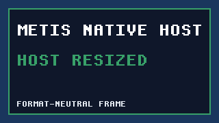
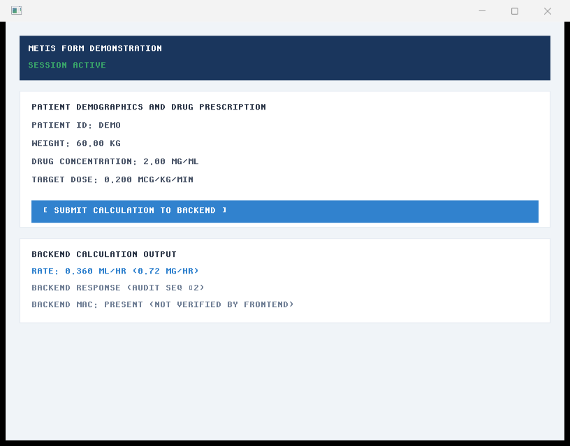
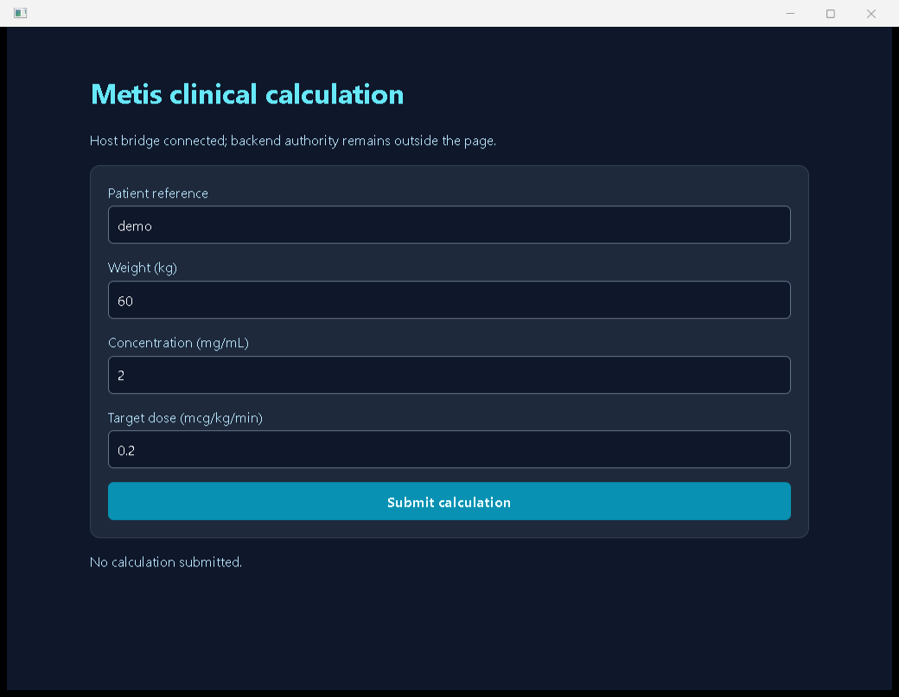
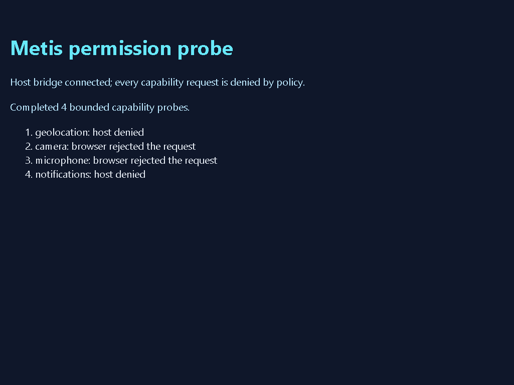
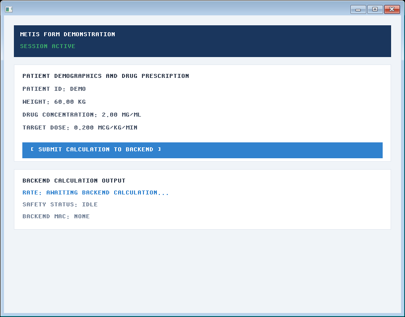
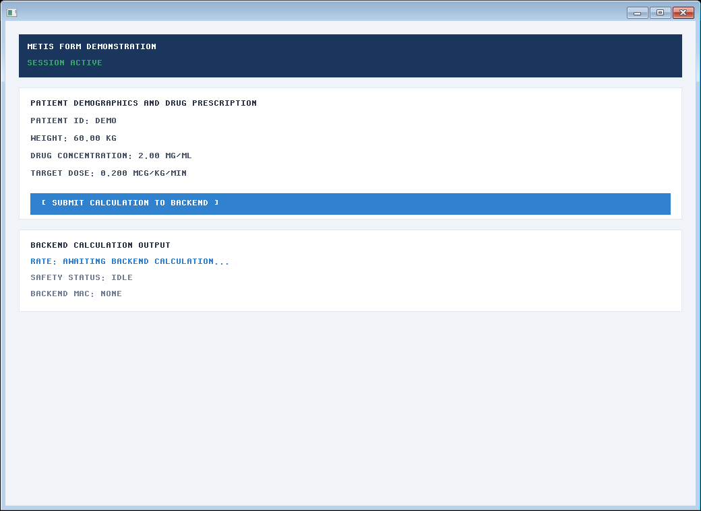
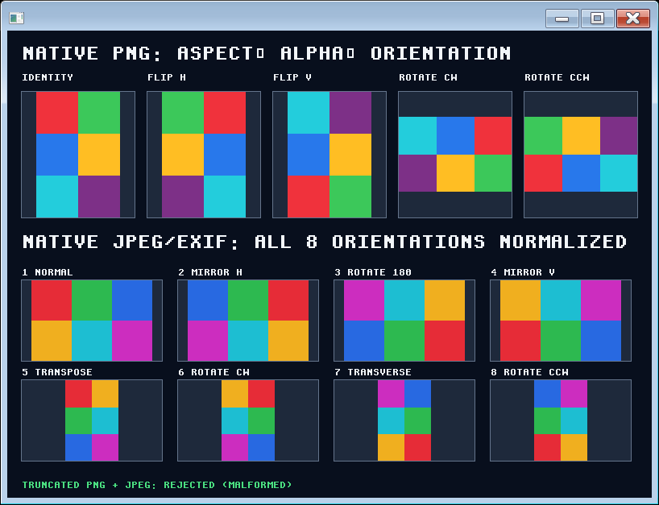

# Run the Windows native surface

The Windows platform crate now has a safe adapter over Moirai's thread-owned
Win32 provider. It owns one native window, translates its messages into bounded
`WindowEvent` values and presents the same row-major `0xAARRGGBB` pixels used by
`Framebuffer`. The adapter does not host HTML/CSS, grant file or network access,
or change the portable `PlatformEvent` queue.

## Run the visible form

The application entry composes the adapter with the existing frontend and the
supervised backend process. On Windows, run:

```powershell
cargo run --locked -p metis-app -- --metis-native-window 60 2 0.2
```

The `Metis native form` window renders the production software framebuffer.
While the window is focused, typed Unicode characters extend the patient
reference and Backspace removes its last scalar; every edit clears a prior
calculation through `FrontendApp::set_inputs`. Press **Enter** or **Ctrl+Enter**
or click the blue **[ SUBMIT CALCULATION TO BACKEND ]** surface to send the
exact numeric inputs through the private pipe. Alt/Windows-modified Enter is
left to the operating system instead of triggering the application shortcut.
The result and audit sequence are painted by the same frontend state machine as
the headless workflow. Resize the window to exercise framebuffer replacement;
DPI, focus and close events are consumed by the host. **Escape** or the window
close control ends the child cleanly.

A host that owns the validated `WindowConfig` can call
`NativeSurface::reopen` after `close` to create a fresh HWND with the same
bounded configuration; reopening a live surface is rejected.

The parent keeps this interactive session under a finite five-minute watchdog
budget so an abandoned window cannot leave a process tree running forever.
This role is Windows-only. Native IME start/update/commit/cancel phases are
consumed by the host; preedit text stays transient and committed UTF-8 text uses
the same bounded patient-field transition as ordinary text input. WebView2
composition remains a separate host role.

The application boundary regression sends the same bounded provider events
through `NativeForm`: start/update changes only the transient preedit, focus
loss cancels it without changing the patient field, and commit applies the
UTF-8 text through the ordinary bounded transition. This is consumer contract
evidence; it does not claim that an installed CJK or other system IME was
exercised. The remaining physical journey is described in the [real Unicode
input capture](#capture-real-unicode-input).

## Inspect custom-renderer accessibility semantics

The software renderer validates a host-neutral semantic projection before it
paints a frame. `FrontendApp::semantic_tree` derives bounded roles, names,
descriptions, values, states, focusability and typed actions from the same
markup that produces the pixels:

```rust,no_run
# use metis_frontend::FrontendApp;
# let (transport, _peer) = metis_ipc::MemoryTransport::pair();
# let app = FrontendApp::new(transport, 800, 600)?;
let tree = app.semantic_tree()?;
let patient = tree
    .root
    .children
    .iter()
    .flat_map(|node| node.children.iter())
    .flat_map(|node| node.children.iter())
    .find(|node| node.id.as_deref() == Some("label-patient"))
    .ok_or_else(|| std::io::Error::other("patient input missing"))?;
assert_eq!(patient.role, metis_ui_lang::SemanticRole::TextBox);
assert_eq!(patient.value.as_deref(), Some("PT-9042-ALPHA"));
assert!(patient.focusable);
assert_eq!(patient.actions, [metis_ui_lang::SemanticAction::SetValue]);
let submit = tree
    .root
    .children
    .iter()
    .flat_map(|node| node.children.iter())
    .flat_map(|node| node.children.iter())
    .find(|node| node.id.as_deref() == Some("btn-calc"))
    .ok_or_else(|| std::io::Error::other("submit action missing"))?;
assert!(submit.focusable);
assert_eq!(submit.actions, [metis_ui_lang::SemanticAction::Activate]);
# Ok::<(), Box<dyn std::error::Error>>(())
```

Duplicate IDs, unresolved references, malformed state values and oversized
semantic strings fail before presentation. Hidden state applies to the whole
semantic subtree, so a descendant cannot restore focus or actions with
`aria-hidden="false"`; visible siblings retain their normal actions. The
projection is not a native
screen-reader bridge: UIA, NSAccessibility and AT-SPI translation, spoken
output and host preference enablement remain platform-specific acceptance
work under `METIS-A11Y-001`.

### Capture the native semantic projection

The `metis-app` executable can write the production form's host-neutral
semantic tree as a bounded JSON artifact. The command uses the same
`FrontendApp` and software-renderer semantic validation as the visible native
surface, but uses an in-memory transport so it does not start a backend or
claim a platform accessibility bridge:

```powershell
New-Item -ItemType Directory -Force output | Out-Null
$semantic = Join-Path (Resolve-Path .) "output\\native-semantic.json"
cargo run --locked -p metis-app -- --metis-semantic-capture $semantic 60 2 0.2
```

The reviewed specimen is
[`native-semantic.json`](images/native-semantic.json). It is schema `1`, has
22 elements and 10,325 bytes, and has SHA-256
`d1bdfc6089d9d34c9538d0de95a5e5b9607dbf9ef0aa0d52649602347be39628`.
The `main-screen` application root, the `label-patient` textbox and the
`btn-calc` submit button are present. The textbox exposes its bounded current
value and typed `set_value` action; the button is focusable, enabled and
exposes the typed `activate` action. The artifact is a deterministic
host-neutral projection. It does not establish
UIA, NSAccessibility or AT-SPI translation, spoken screen-reader output,
platform preference enablement or assistive-technology acceptance; those
remain the native residuals in `METIS-A11Y-001`.

### Use the Windows native accessibility bridge

The Windows native role now forwards the validated semantic tree to Moirai's
AccessKit provider. `NativeForm` supplies the tree before the HWND becomes
visible, so the provider never exposes a partially initialized control tree.
Event-loop updates replace the bounded tree after state changes, and closing
and reopening a surface reinstalls the retained tree:

```rust,no_run
use metis_platform::native::{
    AccessibilityAction, AccessibilityNode, AccessibilityRole, AccessibilityTree,
    NativeSurface, WindowConfig, WindowVisibility,
};

let config = WindowConfig::with_visibility("Metis", 800, 600, WindowVisibility::Hidden)?;
let mut button = AccessibilityNode::new(2, AccessibilityRole::Button, "Submit")?;
button.set_focusable(true);
button.add_action(AccessibilityAction::Activate);
let mut root = AccessibilityNode::new(1, AccessibilityRole::Application, "Metis")?;
root.set_children(vec![2])?;
let tree: AccessibilityTree = AccessibilityTree::from_nodes(1, 2, vec![root, button])?;
let mut surface = NativeSurface::new_with_accessibility(&config, Some(tree.clone()))?;
surface.update_accessibility(tree)?;
# Ok::<(), Box<dyn std::error::Error>>(())
```

The authored form maps its stable `btn-calc` identity to `Activate` and its
stable `label-patient` identity to `Focus` and bounded `SetValue` handling.
Both routes use the same bounded native event queue as keyboard input; an
accepted patient value repaints the frontend and updates the semantic value.
Oversized or control-bearing replacements are rejected before state mutation.
Projection rejects duplicate or zero identities, oversized strings and future
semantic roles/actions that are not in the admitted native vocabulary.
The provider implementation is in Moirai (PRs [#410](https://github.com/ryancinsight/Moirai/pull/410),
[#411](https://github.com/ryancinsight/Moirai/pull/411) and [#414](https://github.com/ryancinsight/Moirai/pull/414)); Metis keeps the
semantic source and application action policy. The component evidence covers
tree installation, updates and reopen; it does not claim that a specific
installed screen reader speaks or operates the form.

### Exercise the Windows UI Automation journey

The optional Windows runner exercises the visible production executable through
the operating system's UI Automation client. It discovers the real `Patient ID`
edit and submit button, sends a bounded `ValuePattern.SetValue` request, invokes
the button with `InvokePattern.Invoke`, waits for the backend result and captures
the window before and after the actions. The runner exits nonzero when the
required controls, value transition or result are absent, and limits the
Automation tree, value bytes and PowerShell response. Run it from the Metis
repository after building `metis-app`:

```powershell
cargo build --locked -p metis-app --bin metis-app
$target = if ($env:CARGO_TARGET_DIR) { $env:CARGO_TARGET_DIR } else { Join-Path (Get-Location) "target" }
$binary = Join-Path $target "debug\metis-app.exe"
New-Item -ItemType Directory -Force output/native-uia | Out-Null
python -S scripts/python_native_accessibility.py `
  --command $binary `
  --argument=--metis-native-window --argument=60 --argument=2 --argument=0.2 `
  --initial-output output/native-uia/initial.png `
  --output output/native-uia/after.png `
  --manifest output/native-uia/trace.json
```

The output directory is ignored run output. A local Windows run on 2026-09-21
used an 818×647 window at 120 DPI and found 10 named UI Automation nodes. It
observed `demo` → `UIA-PATIENT`, then the backend result
`Backend Calculation Output Rate: 0.360 mL/hr (0.72 mg/hr)`; the initial and
after PNGs changed pixels and hash to
`60adf0767bb162e55ea9f21351b18a16d1c20aa870cad9c631abd3eb34109962` and
`54ccf53bda8713b130a50cf916d32c11b137c336fb271c80c1c3b9e6a47df1af`.
The locked build resolved all Moirai packages at merged PR [#414](https://github.com/ryancinsight/Moirai/pull/414),
revision `d7b38d7`, and its `Cargo.lock` SHA-256 is
`95bf4b497677c141308de3ad4d44e3be58e90a000d4eb48befb524779009c568`.
The focused locked native gate passed formatting, warning-denied Clippy and
32/32 `metis-app` nextest cases before this capture. The trace proves the
native provider action path and visible result; it does not prove installed
screen-reader speech, host preference enablement or non-Windows accessibility.

## Apply native display scale

Moirai reports the window's integer DPI through `WindowEvent::DpiChanged`.
The native adapter converts it with `metis_platform::DisplayScale::from_dpi`
and asks `FrontendApp` to repaint. The conversion is fixed-point and uses 96
DPI as the authored CSS baseline: 96 DPI maps to `1.000x`, 120 DPI to
`1.250x`, and 144 DPI to `1.500x`.

`LayoutViewport` carries the physical client dimensions and this scale into
`compute_layout`. Explicit pixel sizes, spacing, borders, automatic child
extents, bitmap text and the submit hit rectangle use the same mapping.
Percent sizes resolve once against the physical viewport, so a percentage is
not scaled twice. A failed repaint restores the last valid scale and frame.
The fixed-point contract is exercised by the layout and rasterizer tests; the
visible captures in this manual were recorded at the host's observed 96 DPI.
Changing the operating-system monitor scale is still a physical-host test and
is reported separately from this deterministic component evidence.

## Share the native frame/event loop

Applications with a software framebuffer can use the reusable host contract
instead of writing a second wait, repaint and close loop. The application keeps
its own state and interprets the complete Moirai event batch; the host creates
the window, presents the initial frame, waits for a finite duration and closes
on a terminal event or `NativeFlow::Exit`:

```rust,no_run
use metis_core::error::MetisError;
use metis_platform::native::{
    run_native_application, NativeApplication, NativeFlow, WindowConfig, WindowEvent,
};
use metis_platform::{Color, Framebuffer};
use std::time::Duration;

struct ViewerApplication {
    frame: Framebuffer,
}

impl NativeApplication for ViewerApplication {
    type Error = MetisError;

    fn framebuffer(&self) -> &Framebuffer {
        &self.frame
    }

    fn handle_events(&mut self, events: &[WindowEvent]) -> Result<NativeFlow, Self::Error> {
        if events.iter().any(|event| {
            matches!(event, WindowEvent::CloseRequested | WindowEvent::Destroyed)
        }) {
            return Ok(NativeFlow::Exit);
        }
        Ok(NativeFlow::Continue { repaint: false })
    }
}

let mut frame = Framebuffer::new(800, 600)?;
frame.clear(Color::DARK_BLUE);
let config = WindowConfig::new("My Metis application", 800, 600)?;
run_native_application(
    &config,
    ViewerApplication { frame },
    Duration::from_millis(250),
)?;
# Ok::<(), Box<dyn std::error::Error>>(())
```

An empty batch means that the finite wait expired and is still delivered to
the application, so bounded animations or timers do not require a second event
loop. A resize handler must replace its frame before returning `repaint: true`.
The contract carries pixels and platform events only. RITK continues to scan,
decode and interpret DICOM data and supplies the resulting viewer presentation
to this boundary; no DICOM knowledge enters Metis.

### Inspect the host trace and frame

The committed `native_host_capture` example runs the real hidden
`NativeSurface` through `run_native_application`; it does not use the
in-memory test driver. Run it from a Windows checkout with a revision label:

```powershell
$revision = git rev-parse HEAD
cargo run --locked --example native_host_capture -- --output output/native-host --source-revision $revision
```

The example records every event batch and framebuffer handed to the host in
[`native-host-trace.json`](images/native-host-trace.json). The reviewed trace
was generated at revision
`dff3bd39aefb73a5c8f78f5e999392c804ac87dd`: the hidden window reports its
320×180 readiness resize, the application replaces the blue frame with the
green resized frame and requests one repaint, then exits on the finite empty
tick. The trace includes the two presentation dimensions, deterministic pixel
checksums and representative ARGB values. The example validates the event and
presentation sequence before writing, then reads the trace back byte-for-byte.

The paired [`native-host-frame.svg`](images/native-host-frame.svg) and
[`native-host-frame.bmp`](images/native-host-frame.bmp) files are generated
from the final framebuffer supplied to the real host. The example decodes the
written bitmap and compares every row-major ARGB pixel to that presented
frame; the SVG is also read back byte-for-byte. The image contains the
software framebuffer only, so operating-system chrome cannot obscure the
rendered pixels:



### Capture a complete native application window

The same capture utility can launch any visible Windows application that uses
the Métis surface and save the complete HWND, including its title bar and
client content. The utility waits for the process to become input-idle, finds
the first visible top-level window owned by that process, captures it with
`PrintWindow`, then posts `WM_CLOSE` and waits for an
orderly exit. The process arguments are passed as separate values; no shell
string is evaluated.

```powershell
$target = (cargo metadata --format-version 1 --no-deps |
  ConvertFrom-Json).target_directory
python scripts/python_native_capture.py `
  --command (Join-Path $target "debug\metis-app.exe") `
  --argument=--metis-native-window `
  --argument=60 `
  --argument=2 `
  --argument=0.2 `
  --output output\native-host-window.bmp
```

Pass a second output and a validated client size to exercise the same
application after a real `SetWindowPos` resize. The utility derives the outer
window rectangle from its current Win32 style, reads the resulting client
rectangle back, forces a synchronous repaint, and records the per-window DPI
before and after the operation:

```powershell
python scripts/python_native_capture.py `
  --command (Join-Path $target "debug\metis-app.exe") `
  --argument=--metis-native-window `
  --argument=60 `
  --argument=2 `
  --argument=0.2 `
  --resize 1024 720 `
  --output output\native-host-window-initial.png `
  --resize-output output\native-host-window-resized.png
```

The JSON line printed by the command contains separate `initial` and
`resized` records with outer and client dimensions, image digests, `dpi`, and
`pixels_changed`. A resize capture proves the requested client geometry was
applied and that the application produced a new frame. It observes the
effective DPI; changing the operating-system display scale is a separate
physical-host journey and is not simulated by this utility.

To exercise that physical journey when the host exposes more than one monitor,
move the same window to a monitor selected by deterministic desktop-coordinate
order and capture it again:

```powershell
python scripts/python_native_capture.py `
  --command (Join-Path $target "debug\metis-app.exe") `
  --argument=--metis-native-window `
  --argument=60 `
  --argument=2 `
  --argument=0.2 `
  --move-monitor 1 `
  --output output\native-host-dpi-initial.png `
  --monitor-output output\native-host-dpi-moved.png
```

The monitor probe enumerates real attached monitors, centers the HWND in the
selected work area, lets the owner process handle its bounded `WM_DPICHANGED`
queue, then captures the resulting frame. Its JSON includes monitor bounds,
initial and moved `dpi`, the corresponding fixed-point `display_scale_milli`,
and `dpi_changed`/`pixels_changed` values. Add `--require-dpi-change` when a
machine-specific acceptance run must fail closed unless the selected monitor
has a different effective DPI. A single-monitor or equal-scale desktop is
reported as `dpi_changed: false`; it is not presented as physical transition
evidence. The two PNGs are still inspectable host captures, and no browser or
DICOM data enters this probe.

On the development Windows desktop used for this revision, the probe observed
one `3072×1728` monitor at `96` DPI. Moving the window to monitor `0` produced
identical initial/moved image digests and `dpi_changed: false`; the host
therefore supplies a real single-monitor capture but no heterogeneous-scale
transition claim. A machine with two monitors at different effective DPI can
rerun the same command with `--require-dpi-change` to turn that residual into a
fail-closed acceptance result.

This is host evidence, so the image includes operating-system chrome and can
vary with the Windows theme, scale and font rasterizer. The deterministic
frame and event trace remain the contract-level checks above. The utility is
format-neutral: applications such as RITK supply their own decoded image and
viewer state before handing pixels to Métis; DICOM parsing and medical display
semantics do not enter this repository. Resolving `target_directory` keeps the
command valid with Atlas's shared build cache and with a standalone checkout.

### Capture real Unicode input

`python_native_input_capture.py` launches the production executable, captures
its first visible frame, focuses that HWND and sends bounded UTF-16 code units
through Win32 `SendInput` with `KEYEVENTF_UNICODE`. The optional
`--shortcut control-enter` argument then sends a real Control+Enter key
sequence through the same queue, exercising the production submission policy.
The runner flushes the target window with a bounded `WM_NULL` call, captures
the resulting frame and writes a manifest containing both image digests,
geometry, effective DPI, the input digest, shortcut name and observed
keyboard-layout handle. The input is delivered by the operating-system queue;
the runner does not post application text messages or modify the framebuffer.

```powershell
$target = (cargo metadata --format-version 1 --no-deps |
  ConvertFrom-Json).target_directory
python scripts/python_native_input_capture.py `
  --command (Join-Path $target "debug\metis-app.exe") `
  --argument=--metis-native-window `
  --argument=60 `
  --argument=2 `
  --argument=0.2 `
  --text "東京😀" `
  --shortcut control-enter `
  --initial-output output\native-unicode-before.png `
  --output output\native-unicode-after.png `
  --manifest output\native-unicode.json
```

The capture is Unicode and shortcut evidence, not installed-IME evidence. The
utility deliberately reports `ime.status = not_exercised`:
`KEYEVENTF_UNICODE` delivers committed text and cannot establish a CJK
preedit/convert/commit journey. A machine with an installed IME still requires
the separate physical keyboard journey recorded under the desktop residuals.
The manifest's `input.foreground_window_set` and `pixels_changed` values must
both be true and both images are inspected; with `--shortcut control-enter`,
the after image must also show the submitted result. Foreground activation
denial is a failed capture, and a process exit alone is not a pass.

The older OS-window captures below demonstrate the visible form and WebView2
shell. RITK's migrated Windows viewer session now supplies a validated frame
through the format-neutral boundary; the integration is tracked in
[RITK PR #267](https://github.com/ryancinsight/ritk/pull/267) and its
[DICOM workflow manual](https://github.com/ryancinsight/ritk/blob/main/docs/manual/dicom-workflow.md).
Metis remains format-neutral: it owns the host window, events and framebuffer,
while RITK owns DICOM opening, decoding and medical display semantics.

## Embed packaged HTML and CSS with WebView2

`metis_platform::native::WebViewSurface` embeds the Moirai WebView2 provider in
the same thread-owned HWND boundary. The entry page must be a validated
`file:///` URI; navigation is restricted to that entry directory, new-window
requests are denied and page messages are bounded JSON values. The surface
does not grant page code filesystem, network or process authority. The
WebView2 runtime must be installed on the Windows machine. The Windows
`metis-platform` target explicitly enables Moirai's `webview2` feature; other
Metis targets do not pull the optional COM binding. The standalone Cargo.lock currently pins merged Moirai revision
`88f837ea90c694c5c0b62793fe1edb02b39bdddc`, which includes the AccessKit
provider and WebView2 0.39.1 bindings. The current lock retains the provider feature,
bounded host implementation, stable browser canvas extents, the content-box
mapping used by the RITK consumer and the bounded `CapturePreview` PNG path;
it also contains the later WebGPU provider recreation. The capture hash and
runtime provenance remain tied to the revision that produced that artifact.
WebGPU is a browser-only opt-in surface; native WebView2 packaging does not
claim GPU presentation evidence.

The application executable includes a complete supervised form path over this
boundary:

```powershell
cargo run --locked -p metis-app -- --metis-webview 60 2 0.2
```

The host writes a bounded temporary package containing the form, stylesheet and
bridge script, then removes it after the window closes. Submitting the form
crosses the WebView2 message callback, the unprivileged frontend's private pipe
and the backend's existing capability and audit checks before the result is
posted back to the page. Its content-security policy admits only the package's
own script and stylesheet; images, fonts, media, network connections, objects,
frames, workers, manifests and forms are denied. The page script uses only the
bounded `chrome.webview.postMessage` bridge; WebView2 host objects and process
APIs are not registered. The provider separately rejects arbitrary navigation
and new-window requests. These are package/provider restrictions, not a claim
that the operating system sandbox has been proven. The Moirai provider also
handles every WebView2 `PermissionRequested` callback, sets the state to deny
before profile or operating-system prompting, and forwards a bounded
`WebViewEvent::PermissionDenied` snapshot. `metis-app` renders that event as a
`permission_denied` page error with `ErrorCode::PermissionDenied`; the default
calculation page requests no capability, so the existing form capture remains
unchanged. A consumer page that requests geolocation or another capability
will show the denied label without receiving an allow decision. Escape or the
close button ends the finite five-minute session.

### Verify the installed WebView2 adapter

On Windows with WebView2 installed, run the ignored adapter smoke from the
workspace root:

```powershell
cargo nextest run --locked -p metis-platform --all-targets --run-ignored all installed_runtime_loads_packaged_page_and_closes_surface
```

The smoke uses a hidden native host, loads a temporary packaged page, checks a
successful navigation, rejects an external HTTPS navigation and observes the
denied-navigation event, then closes the surface. It passed against WebView2
runtime `152.0.4191.66`. The companion
`installed_runtime_denies_geolocation_permission` smoke was also attempted on
the currently installed runtime `153.0.4234.32`, but its file-origin page did
not emit a callback before the bounded wait; that result is retained as a
provider residual, not a pass claim. The visible application capture below
does receive and render the typed denial. Both tests are ignored unless the
WebView2 runtime is installed. A hidden smoke is not a visual or accessibility
capture; the visible form workflow is recorded below.

```rust
use metis_platform::native::{
    WebViewConfig, WebViewHostEvent, WebViewSurface, WindowConfig, WindowVisibility,
};
use std::time::Duration;

let window = WindowConfig::with_visibility(
    "My Metis web application",
    1024,
    768,
    WindowVisibility::Visible,
)?;
let page = WebViewConfig::new("file:///C:/Apps/MyMetis/index.html")?;
let mut surface = WebViewSurface::new(&window, page)?;

for event in surface.wait_events(Duration::from_millis(250))? {
    match event {
        WebViewHostEvent::Window(_) | WebViewHostEvent::WebView(_) => {}
    }
}
surface.close()?;
# Ok::<(), Box<dyn std::error::Error>>(())
```

Resize the surface when the parent window reports a new client size. Use
`set_visibility` for explicit visibility transitions and `post_json` for a
bounded page bridge. Keep command authorization in the host or service layer;
the browser page is an untrusted renderer.

## Verify the provider

Run the focused package gate on Windows:

```text
cargo nextest run --locked -p metis-platform
cargo clippy --locked -p metis-platform --all-targets -- -D warnings
```

The native tests create real hidden `HWND` values, present production
framebuffers, post pointer, keyboard, text, IME composition, resize and DPI
messages through the provider, observe bounded event batches, and close the
windows. The two-window test confirms each surface retains its own dimensions
and that closing one leaves the other live. The tests do not use mock windows or
default frames. Hidden test windows are lifecycle evidence; they are not visible
application captures.

## Captured Windows workflows

The following captures were taken from the production `metis-app` executable
built at revision `0c8bcc32911c087bf686588cd4a7c56a29d0b92e` on
`x86_64-pc-windows-msvc`. The installed WebView2 runtime was
`152.0.4191.66`. Exact image hashes, window sizes and action traces are stored
in [`native-captures.json`](images/native-captures.json).

### Software framebuffer window

The initial native window is an 800×600 client area inside an 816×639 outer
window. It shows the production form, an active supervised session and the
waiting backend state:


Pressing **Enter** while the window is focused submits the same values through
the private pipe. The captured response is input-sensitive and includes audit
sequence 2 and a present backend MAC:



### Packaged WebView2 window

The WebView2 page is a 1024×768 client area inside a 1040×807 outer window. The
initial capture shows the local HTML/CSS package and the connected host bridge;
the page still reports that no calculation has been submitted:



A trusted operating-system pointer click on **Submit calculation** sends the
typed message through the WebView2 callback and private backend pipe. The page
then displays `Rate 0.36 mL/hour; drug 0.72 mg/hour; audit 2`:


The packaged page also exposes the four theme modes used by the browser
workbench: **System preference**, **Light**, **Dark** and **High contrast**.
Changing the selector updates only the document's `data-metis-theme` attribute
and local CSS variables. It does not send a bridge message or alter backend
authority. The packaged executable also has a bounded capture role, which
selects the initial mode before the page is shown and writes the provider's
`CapturePreview` PNG after the first event batch:

```powershell
cargo run --locked -p metis-app -- --metis-webview-theme-capture C:\captures\metis-webview-theme-light.png light 60 2 0.2
```

Repeat the command with `system`, `light`, `dark` and `high-contrast` (and a
different absolute `.png` path for each mode). The four inspected captures
below came from the packaged Windows executable; each contains the rendered
form and its selected mode, rather than a stylesheet or DOM-only assertion:

| Mode | Capture | PNG bytes | Dimensions | SHA-256 |
| --- | --- | ---: | ---: | --- |
| System preference | [webview-theme-system.png](images/webview-theme-system.png) | 12,991 | 1025×769 | `15c88ffd69531b815e71e28951b2b2bb09e274f2dd6c4c7bc6155b684499e6a6` |
| Light | [webview-theme-light.png](images/webview-theme-light.png) | 12,529 | 1025×769 | `ec3caec1fd604ffc1272cfdffc958661e40ed90057636c487c601fc601ab8b7e` |
| Dark | [webview-theme-dark.png](images/webview-theme-dark.png) | 12,492 | 1025×769 | `75730d4d78b9b8cf499a15afb8d228c1b2ef71ecac9a0e081789ee582d418694` |
| High contrast | [webview-theme-high-contrast.png](images/webview-theme-high-contrast.png) | 12,802 | 1025×769 | `d1523c8f8bb5daff330ac90131e7b316ce6ce4c89d94ef043a923c4db827b160` |

The system capture follows the host preference on the capture machine; the
other three captures prove the explicit palettes. For a manual interaction
check, launch the ordinary `--metis-webview` command above, focus **Theme**, select each option,
and inspect the page background, surface, text, focus ring and result status
before submitting the calculation. These images establish visible palette
selection through the packaged provider. They do not establish screen-reader
behavior, installed-IME behavior, or physical high-DPI transitions.

### WebView2 permission-probe capture

The permission-probe role loads a separate packaged page that requests
geolocation and reports the host's typed denial. Its capture form asks WebView2
for a PNG through `CapturePreview`, so the inspected pixels do not depend on
GDI or whether the window is visible to the desktop compositor:

```powershell
cargo run --locked -p metis-app -- --metis-webview-permission-probe-capture C:\captures\metis-permission-probe.png 60 2 0.2
```

The output path is an absolute `.png` path. The capture is written once after
the first bounded event batch; close the window or press **Escape** to finish
the supervised session. The committed run used Metis revision
`285322892aca245faf3962d57838682dd6689d77`, Moirai revision
`d324018efa3b67d2b92350a4e3c781d179019014`, WebView2 runtime
`153.0.4234.32`, and a 1024×768 client area. It produced 6,561 bytes with
SHA-256
`a9df158ff6a167ed3c708e9621a44446cae93b3c0d87e646c818601606a33b8f` and shows
`permission_denied: WebView2 denied geolocation access request [0x200f]`.
The image is the inspected visual artifact:



The full command, observed text and digest are recorded in
[`native-captures.json`](images/native-captures.json).

### Scoped native file reads

Native applications that need bytes from a host-selected directory use
`metis_platform::ScopedFileProvider`. The host first authorizes a
`CapabilityScope::READ_FILE` witness; the provider then opens a relative path
through Moirai's directory-handle walk. Parent components, symlinks,
directories and files larger than 64 MiB are rejected before bytes are
returned. The provider has no DICOM knowledge and does not expose an
unrestricted frontend path; RITK remains the owner of DICOM scanning and
decoding.

The denial and byte-value contract is executable in the platform test suite:

```powershell
cargo nextest run --locked -p metis-platform --lib
```

The `scoped_file` tests cover a successful nested read, traversal and size
rejection, and a host-policy token without `READ_FILE` scope. This is provider
security evidence; it does not substitute for the real RITK MRI captures
linked in the [DICOM workflow manual](https://github.com/ryancinsight/ritk/blob/main/docs/manual/dicom-workflow.md).

### Scoped native process execution

Native applications that need a host sidecar use
`metis_platform::ScopedProcessProvider`. The host supplies one absolute regular
executable, a finite value allowlist for every argument and, when required, a
bounded explicit environment. A caller must present a
`CapabilityScope::RUN_PROCESS` witness. The provider passes operating-system
arguments directly, clears the environment by default and never accepts a
shell command string or a browser-selected executable path.

The provider caps stdout, drains the opt-in Moirai stderr pipe without
returning its bytes, reports only the stderr byte count, and applies a finite
deadline followed by bounded cleanup. Rejected arguments, missing capability,
invalid paths, invalid deadlines and cleanup failures are typed errors. The
real-child platform tests cover successful stdout, stderr redaction, argument
denial, missing scope and deadline termination:

```powershell
cargo nextest run --locked -p metis-platform --lib
```

This boundary is format-neutral. RITK owns DICOM parsing, study selection and
clinical presentation after its own provider receives bytes; a sidecar does
not grant the browser arbitrary native shell access.

### Native form after a real resize

The same production `metis-app.exe` was captured before and after the host
received a real Win32 client resize from 800×600 to 1024×720. The initial and
resized frames both retain the active supervised session and form controls;
the second frame is larger because `FrontendApp::resize` rebuilt its
framebuffer and layout. The host observed 96 DPI at both sizes, and the
capture utility recorded changed pixels and exact SHA-256 digests in
[`native-resize.json`](images/native-resize.json).





The capture session closed the supervised parent and child processes after each
workflow. These images establish the visible initial, successful and
permission-denied journeys; they do not establish native accessibility
technology, an installed CJK IME, a physical display-scale change, or
macOS/Linux hosts. The provider-level geolocation smoke remains a separate
runtime residual because WebView2 `153.0.4234.32` did not emit its file-origin
callback within the bounded wait.
For a real application frame with saved DICOM pixels, follow the
[RITK DICOM workflow](https://github.com/ryancinsight/ritk/blob/main/docs/manual/dicom-workflow.md);
RITK owns opening and decoding those files and Métis owns this format-neutral
window and framebuffer seam.

## Connect a host

Create the validated configuration and keep all operations on the creating
thread:

```rust
use metis_platform::{Color, Framebuffer};
use metis_platform::native::{NativeSurface, WindowConfig, WindowEvent};
use std::time::Duration;

let config = WindowConfig::new("My Metis window", 800, 600)?;
let mut surface = NativeSurface::new(&config)?;
let mut frame = Framebuffer::new(800, 600)?;
frame.clear(Color::DARK_BLUE);
surface.present(&frame)?;

for event in surface.wait_events(Duration::from_millis(250))? {
    match event {
        WindowEvent::CloseRequested | WindowEvent::Destroyed => surface.close()?,
        WindowEvent::Resized { width, height } => {
            // Rebuild the application framebuffer at the reported client size.
            let _ = (width, height);
        }
        _ => {}
    }
}
# Ok::<(), Box<dyn std::error::Error>>(())
```

Call `wait_events` with a finite duration from the host's bounded scheduler and
present only validated frames. `CloseRequested` is a policy signal; the host
decides when to call `close`. `WindowEvent` preserves focus, key-up, Unicode
text and DPI values that the portable application-supplied `PlatformEvent` type
does not model.

## Current limits

The visible `metis-app` composition and its private-IPC workflow are now
implemented. The provider tests exercise two independent hidden HWNDs and close
and reopen one only after close, reusing its validated configuration; reopening
a live surface is rejected. The host trace and framebuffer image above verify
the format-neutral frame/event seam, the four original OS-window captures
establish the visible native and WebView2 initial/submit journeys, and the
resize pair proves a real client-size transition with a rebuilt frame. A native
keyboard/IME journey is still required for V05 input acceptance. The software
mapping for fractional display scales is covered by deterministic component
tests, while a physical monitor transition, broader OS permission enforcement,
native accessibility, an installed CJK or other IME journey, macOS/Linux
providers, two-window captures and the viewer host remain V05 and migration
work. WebView2 provider denial and a visible permission-probe capture are
covered; broader Windows sandbox enforcement remains open. Do not treat a
successful Windows build or a hidden-window test as cross-platform,
assistive-technology or broad OS-permission evidence.

## Native image assets

The Windows `native_image` example decodes a repository-authored asymmetric
RGBA PNG and a JPEG color grid. The PNG row exercises five explicit display
transforms and a half-transparent magenta sample. The JPEG rows exercise all
eight EXIF orientation values, including transpose and transverse, through
the decoder. Each resulting raster is displayed with identity placement:
metadata orientation has already been applied once. Rejection labels report
actual malformed-input decode results.



The [capture record](images/native-image.json) binds the executable and source
digests to a visible Windows capture at 120 DPI. The committed PNG includes
the 818×627 window and its 800×580 client at offset (9,38). All 464,000 client
RGB pixels equal the example's independently read-back framebuffer BMP. The
PNG original and mirrored images occupy 104×156 pixels inside 140×156 bounds;
quarter-turns occupy 140×93 pixels. The remaining area is letterboxed. RGBA
`(220,55,210,128)` over RGB `(30,41,59)` produces exactly RGB `(125,48,135)`
under the shared integer source-over rule. JPEG produces opaque pixels. Six
constant-block samples are checked against an independent Pillow decode with
a one-sample bound derived from the decoder's fixed-point color coefficients.
Orientation and aspect assertions then compare those decoded samples in their
specified positions, without treating lossy JPEG as an exact RGB encoder. The
capture verifies Windows presentation on this host, including the right and
bottom edges. It does not establish heterogeneous-monitor DPI transitions.

Build and run the demonstration from a standalone Metis checkout:

```text
cargo run --locked --example native_image
cargo run --locked --example native_image -- --visible
```

The default is a bounded hidden-window smoke. Visible mode closes on a window
close event or its 20-second deadline. The existing
`scripts/python_native_capture.py --command` runner captures the built example
with `--argument=--visible`; the configured gate runs its hidden mode under a
60-second process budget. Atlas checkouts use the existing
`scripts/cargo_overlay.py` standalone Cargo context and shared target directory.

`RasterImage::load` requires a `READ_FILE` capability and a relative path below
a `ScopedFileProvider` root. Admission rejects absolute paths, parent
components, alternate streams and the provider's link/non-regular-file cases.
`RasterImage::decode` selects PNG or JPEG from bytes, not the filename. Encoded
input is bounded to 64 MiB, each edge to 16,384 and output to 16,777,216 pixels.
The [admission ADR](../adr/0029-image-orientation.md) specifies the format and
workspace budgets, metadata policy and independent orientation oracle.

PNG retains straight alpha and supports grayscale, RGB, RGBA and complete
palettes up to eight-bit samples, including Adam7. CRC, Adler checksum,
complete compressed-stream consumption and exact scanline length are checked.
JPEG uses the shared Consus raster decoder for sequential, progressive and
eight-bit lossless samples. Wider lossless medical samples remain available to
RITK; this display API rejects them rather than choosing a window or truncating.
JPEG/PNG EXIF orientation values 1–8 normalize into the returned dimensions
and pixels; malformed metadata fails. Unsupported color profiles, animation
and physical spacing fail closed. Clinical orientation remains RITK-owned.

The shared JPEG encoder includes an IJG-derived discrete cosine transform:
this software is based in part on the work of the Independent JPEG Group.
