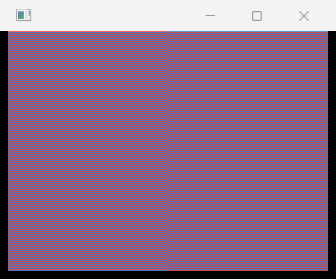
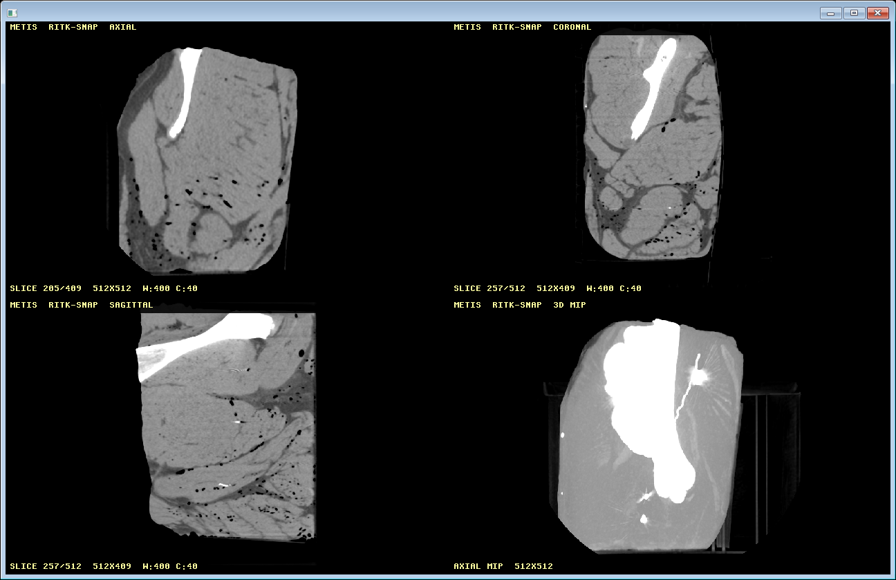

# Python binding

Metis exposes a typed Python package over the same Rust validation and backend
calculation used by the application. The native extension is `metis._metis`;
the installable distribution is `metis-rs` because the existing
[PyPI `metis` project](https://pypi.org/project/metis/) is an unrelated
package. Python code owns composition and presentation of values. Rust owns
units, bounds, arithmetic and the safety envelope.

## Build and exercise locally

Install the pinned build tools in an active Python environment:

```powershell
python -m pip install "maturin==1.14.1" "pytest==8.4.2"
python scripts/python_binding.py
```

The script builds a locked release wheel from
`crates/metis-python/pyproject.toml`, extracts it into a temporary directory
and runs the tests in `crates/metis-python/tests`. It does not install into the
active interpreter. Before extraction, the gate verifies the wheel's single
native extension, `metis/__init__.py`, `py.typed`, `_metis.pyi`, typed package
metadata, Python 3.9 floor and `abi3` tags. The wheel uses the CPython 3.9
stable ABI.

## Calculate through Rust

```python
import metis

result = metis.calculate_infusion_rate(
    metis.PatientWeight(60.0),
    metis.DrugConcentration(2.0),
    metis.TargetDose(0.2),
)
print(result.rate_ml_hr)      # 0.36
print(result.drug_rate_mg_hr) # 0.72
```

The constructors reject non-finite and out-of-range values before the backend
runs. A custom envelope is explicit:

```python
envelope = metis.SafetyEnvelope(
    adult_rate_ml_hr=300.0,
    pediatric_rate_ml_hr=50.0,
    pediatric_weight_threshold_kg=35.0,
)
result = metis.calculate_infusion_rate(
    metis.PatientWeight(25.0),
    metis.DrugConcentration(1.5),
    metis.TargetDose(0.5),
    envelope,
)
assert result.is_pediatric
```

## Compose a Rust-owned image frame

The wheel exposes the same bounded software image contract used by the Metis
presentation path. Pixels are row-major RGBA bytes; crops and destinations are
validated in Rust, and destinations may be clipped by the canvas.

```python
import metis

image = metis.RasterImage(
    2,
    1,
    bytes((229, 62, 62, 255, 49, 130, 206, 255)),
)
canvas = metis.Canvas(3, 2)
canvas.clear(255, 255, 255, 255)
canvas.draw_image(
    image,
    metis.Rect(0, 0, 2, 1),
    metis.Rect(-1, 0, 4, 2),
)
assert canvas.to_rgba()[:4] == bytes((229, 62, 62, 255))
```

`Canvas.to_rgba()` returns a cold-boundary copy so Python code can hand the
frame to another renderer without sharing Rust storage. The inspected
software-renderer fixture shows the same placement and alpha semantics in the
[image presentation demonstration](applications.md#raster-image-presentation).
This surface does not open a native window, run a second event loop or decode
DICOM bytes; those capabilities stay with the Metis host and RITK contracts.
The bounded allocation and row-major copy run inside PyO3's detached region;
the `bytes` object is created only after the copy returns to Python. A large
software frame therefore does not hold the interpreter lock while Rust reads
the framebuffer.

`ValueError` messages retain the stable Metis error code and trace identifier,
so a caller can distinguish invalid input from a rate interlock without
reimplementing Rust's error taxonomy. The calculation releases the Python
interpreter lock while Rust computes, allowing unrelated Python threads to
progress.

The extension module declares `gil_used = false` after a compile-time `Send +
Sync` audit of every exposed Rust class. The lifecycle tests exercise concurrent
mutation of one `Application` and, when run by a free-threaded interpreter,
assert that importing `metis` leaves `sys._is_gil_enabled()` false. The release
caller ships separate CPython 3.9 `abi3` wheels, `cp314-cp314t` and `cp315-cp315t`
free-threaded wheels, and Python 3.15 `abi3t` wheels. The package `abi3t`
feature selects PyO3 `abi3t-py315`; the default feature selects `abi3-py39`.
Atlas installs each artifact and runs the same value-semantic suite. The
`abi3t` matrix currently excludes musllinux because its Python 3.15t image is
unavailable.

## Host a native window

`NativeApplication` is the wxPython-like host boundary for Python composition.
It is a thin handle over a Rust-owned provider thread; Python does not receive
callbacks or run a second event loop. On Windows, create a bounded visible or
hidden window, present row-major RGBA bytes, and consume finite typed event
batches:

```python
import metis

host = metis.NativeApplication("Metis example", 320, 240, "visible")
generation = host.generation
host.present(generation, bytes((49, 130, 206, 255)) * (320 * 240))
events = host.wait_events(generation, 0)
host.close(generation)
generation = host.reopen()
host.close(generation)
```

The provider validates the title, dimensions, frame length, wait bound and
close/reopen generation. Event dictionaries preserve pointer, keyboard, text,
IME composition, resize, DPI and lifecycle fields. Non-Windows builds retain
the typed class but construction returns `ERR_UNSUPPORTED_PLATFORM_EVENT`
without attempting a native provider. This facade owns no filesystem,
network, process, medical-format or DICOM authority; RITK remains responsible
for DICOM and viewer state. Frame submission converts the borrowed Python bytes
before detaching; the Rust provider request, bounded event wait, close and
reopen operations then run without the interpreter lock. Event dictionaries
are created after reattachment, so no Python object crosses the host thread.

### Host independent windows

Each `NativeApplication` owns one Rust provider thread and one generation-bound
surface. Multiple applications can therefore be created without sharing window
dimensions, event queues or close state:

```python
first = metis.NativeApplication("First", 320, 240, "hidden")
second = metis.NativeApplication("Second", 640, 480, "hidden")
first_generation = first.generation
second_generation = second.generation
first.present(first_generation, bytes((229, 62, 62, 255)) * (320 * 240))
second.present(second_generation, bytes((49, 130, 206, 255)) * (640 * 480))
assert any(
    event["kind"] == "resized" and event["width"] == 320
    for event in first.wait_events(first_generation, 0)
)
assert any(
    event["kind"] == "resized" and event["width"] == 640
    for event in second.wait_events(second_generation, 0)
)
first.close(first_generation)
second.present(second_generation, bytes((12, 34, 56, 255)) * (640 * 480))
second.close(second_generation)
```

The value-semantic wheel suite runs this journey with two independent hidden
windows and confirms that closing the first does not invalidate the second.
The provider's native tests separately exercise keyboard, text and IME event
translation; a trusted installed-IME capture remains host evidence rather than
a Python API assumption.

### Inspect a captured native frame

Build an extracted wheel and use the committed Windows capture tool to present
a Rust-owned checkerboard through a visible `NativeApplication` window. The
tool pumps the provider thread while GDI captures the HWND, then closes the
window and prints the image digest:

```powershell
maturin build --release --locked --manifest-path crates/metis-python/Cargo.toml --out output/python-native
python scripts/python_native_capture.py `
  --wheel output/python-native/metis_rs-0.1.0-cp39-abi3-win_amd64.whl `
  --output docs/manual/images/python-native-window.bmp
```

The inspected capture is a 320×240 client area in a 336×279 window. It shows
the two input-sensitive colors, the visible title bar and two bounded resize
events from generation `0`. Its source revision, runtime, and SHA-256 digest
are recorded in [`python-native-captures.json`](images/python-native-captures.json).



### Present an actual RITK application frame

The same capture tool can present an existing application-content PNG through
the Python host. This is the handoff used for real viewer evidence: RITK opens
and decodes the study, renders the bounded framebuffer and writes the PNG;
Métis validates the already-decoded RGBA frame and presents those exact pixels
through `NativeApplication`. The Python boundary does not read DICOM bytes or
interpret clinical metadata.

Use the reviewed public CT frame from the RITK repository, or replace the path
with a private local capture that must remain outside version control:

```powershell
$frame = Resolve-Path ..\ritk\docs\manual\images\dicom-metis-real-ct-mip.png
maturin build --release --locked --manifest-path crates/metis-python/Cargo.toml --out output/python-native
python scripts/python_native_capture.py `
  --wheel output/python-native/metis_rs-0.1.0-cp39-abi3-win_amd64.whl `
  --frame $frame `
  --title "RITK public CT through Metis Python host" `
  --output docs/manual/images/python-native-real-ct-mip.png
```

`--frame` accepts only a bounded, non-interlaced 8-bit RGBA PNG and derives
the host dimensions from its header. All PNG scanline filters are decoded and
the source digest is printed with the capture result, so the provenance binds
the Python-hosted image to the exact RITK output. The inspected capture below
is application output from the saved public 409-file CT study, including its
axial, coronal, sagittal and MIP panels; it is not an illustration.



The source is the public CC BY 4.0 porcine-head phantom documented in the
[RITK DICOM workflow](https://github.com/ryancinsight/ritk/blob/main/docs/manual/dicom-workflow.md).
Private patient captures may use the same command locally, but their pixels,
paths and identifiers stay on the local machine.

## Release path

`.github/workflows/python-release.yml` accepts a GitHub Release tag of the form
`metis-python-v<version>`. Atlas builds and tests the wheel on the supported
systems, attaches the artifacts and emits a source distribution. The publish
job requests only GitHub's OIDC identity and uses PyPI Trusted Publishing; no
PyPI API token, SSH key or developer private key is stored in the repository.
The `pypi` environment and the `metis-rs` trusted publisher are administrative
release prerequisites. A local build or a workflow dispatch does not publish.

This binding increment does not expose native window classes or DICOM objects.
Those surfaces will follow their public Rust contracts and host or decoder
evidence, so the Python API cannot silently diverge from the desktop and web
paths.

## Own a bounded software application

`Application` is the Python entry point for a Rust-owned virtual surface. It is
portable across Python hosts because it does not create an operating-system
window or run an event loop. The host supplies input and consumes frames.

```python
import metis

app = metis.Application(2, 1)
generation = app.generation
app.clear(generation, 10, 20, 30, 255)
app.key_down(generation, 41)
assert app.poll_event(generation) == {"kind": "key_down", "key": 41}
assert app.to_rgba(generation) == bytes((10, 20, 30, 255)) * 2
app.close(generation)
generation = app.reopen(2, 1)
```

The generation token makes close and reopen safe: operations from an earlier
surface cannot write or read the new one. The event queue has a fixed capacity
and rejects additional input with `ERR_RENDER_FAILURE`; draining is explicit
through `poll_event`. `Application` is synchronized by Rust's `Mutex`, so
concurrent Python calls share one state machine without callbacks, Python-owned
framebuffer storage or a second event loop. The lock uses PyO3's
interpreter-aware acquisition path. `to_rgba` detaches the bounded Rust frame
copy and creates `bytes` after the state guard is released; Python objects are
created only on the attached side. Native window providers and RITK's DICOM
decoding remain separate boundaries.

Run the same built-wheel check used by the repository gate when changing this
surface:

```powershell
python scripts/python_binding.py
```

The command builds one locked wheel, validates its typed stable-ABI metadata,
extracts it into an isolated directory, and runs the value-semantic suite
against that extracted artifact. The free-threaded runtime probe is expected to
be skipped on a regular GIL-enabled interpreter; the hosted `cp3XXt` and
`abi3t` artifact checks are owned by the release matrix in
`METIS-PYTHON-004`.
